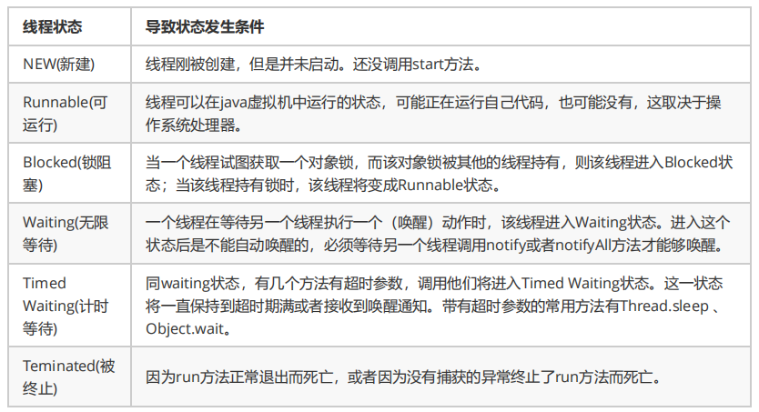
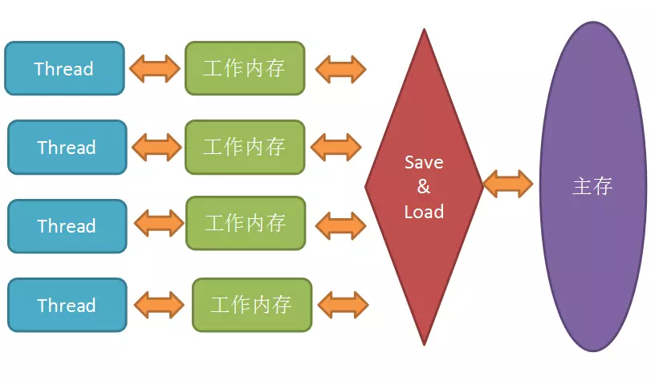

## 1.进程和线程

- 一个程序至少有一个进程，一个进程至少有一个线程。
- 进程是资源分配的基本单位，线程是程序执行的最小单位。
- 多个线程共享进程的**堆**和**方法区 (JDK1.8 之后的元空间)**资源，但是每个线程有自己的**程序计数器**、**虚拟机栈** 和 **本地方法栈**。

## 2.并发和并行

- **并发**：指两个或多个事件在**同一个时间段内**发生。 

- **并行**：指两个或多个事件在**同一时刻**发生（同时发生）。

## 3.Thread类

**构造方法**

- public Thread() :分配一个新的线程对象。 

- public Thread(String name) :分配一个指定名字的新的线程对象。 

- public Thread(Runnable target) :分配一个带有指定目标新的线程对象。 

- public Thread(Runnable target,String name) :分配一个带有指定目标新的线程对象并指定名字。 

**常用方法**

- public String getName() :获取当前线程名称。 

- public void start() :导致此线程开始执行; Java虚拟机调用此线程的run方法。 

- public void run() :此线程要执行的任务在此处定义代码。 

- public static void sleep(long millis) :使当前正在执行的线程以指定的毫秒数暂停（暂时停止执行）。 

- public static Thread currentThread() :返回对当前正在执行的线程对象的引用。 

## 4.创建线程的方式

**继承Thread类并重写run的方法**

当调用 start() 方法启动一个线程时，虚拟机会将该线程放入就绪队列中等待被调度，当一个线程被调度时会执行该线程的 run() 方法。

```java
public class MyThread extends Thread {
    //重写run方法
    public void run() {
        // ...
    }
}

public static void main(String[] args) {
    //创建线程
    MyThread mt = new MyThread();
    //启动线程
    mt.start();
}

//匿名内部类
new Thread() {
	public void run() {
				
	}
}.start();//开启线程
```

**实现Runnable接口的run方法**

通过 Thread 调用 start() 方法来启动线程

```java
public class RunnableTask implements Runnable {
    public void run() {
        // ...
    }
}
public static void main(String[] args) {
    RunnableTask task = new RunnableTask();
    new Thread(task).start();
    new Thread(task).start();
}

//匿名内部类
new Thread(new Runnable()) {
	public void run() {
				
	}
}.start();//开启线程
```

**实现Callable接口的call方法**

在main函数内首先创建一个FutrueTask对象，然后使用创建的FutrueTask对象作为任务创建一个线程并且启动它，最后通过FutureTask.get()等待任务执行完毕并返回结果。

```java
 public class CallerTask implements Callable<String> {
    public String call() throws Exception {
        return "hello"
    }
}
public static void main(String[] args) throws InterruptedException {
    //创建异步任务
    FutureTask<Integer> ft = new FutureTask<>(new CallerTask);
    //启动线程
    new Thread(ft).start();
    try{
    	String result = ft.get();
    	System.out.println(result);
    }catch(ExecutionException e){
        e.printStackTrace();
    }
}
```

**对比**

- 实现Runnable接口相比于继承Thread类的优势
  - 避免单继承的局限
  - 适合资源的共享
- 实现Callable接口的优势
  - **call()方法可以有返回值，也可以抛出异常。**

## 5.线程的状态



## 6.线程的方法

> Object 方法 wait() wait(long) wait(long,int) notify() notifyAll()

> Thread 方法 start() join() join(long) join(long,int)  sleep() yield() interrupt()

### sleep() 方法和 wait() 方法

- 两者最主要的区别在于：**sleep 方法没有释放锁，而 wait 方法释放了锁** 。
- 两者都可以暂停线程的执行。
- wait 通常被用于线程间交互/通信，sleep 通常被用于暂停执行。
- wait() 方法被调用后，线程不会自动苏醒，需要别的线程调用同一个对象上的 notify() 或者 notifyAll() 方法。sleep() 方法执行完成后，线程会自动苏醒。或者可以使用wait(long timeout)超时后线程会自动苏醒。
- `wait`、`notify`、`notifyAll`只能在同步控制方法或同步控制块中使用，而`sleep`可以任何地方使用。

### notify()和notifyAll()

唤醒因调用这个对象wait()方法而阻塞的线程，随机。

唤醒全部

### yield()

让线程让出CPU使用权，在大多数情况下，yield()将导致线程从运行状态转到可运行状态，但有可能没有效果。

### join()

等待其他线程终止。在当前线程中调用另一个线程的join()方法，则当前线程转入阻塞状态，直到另一个进程运行结束，当前线程再由阻塞转为就绪状态。

> *在很多情况下，主线程生成并起动了子线程，如果子线程里要进行大量的耗时的运算，主线程往往将于子线程之前结束，但是如果主线程处理完其他的事务后，需要用到子线程的处理结果，也就是主线程需要等待子线程执行完成之后再结束，这个时候就要用到 join() 方法了。*

### interrupt()

中断

如果线程处于被阻塞状态（例如处于sleep, wait, join 等状态），那么线程将立即退出被阻塞状态，并抛出一个InterruptedException异常。

如果线程处于正常活动状态，那么会将该线程的中断标志设置为 true，仅此而已。被设置中断标志的线程将继续正常运行，不受影响

## 7.死锁


线程 A 持有资源 2，线程 B 持有资源 1，他们同时都想申请对方的资源，所以这两个线程就会互相等待而进入死锁状态。

代码例子：

```java
public class DeadLockDemo {
    private static Object resource1 = new Object();//资源 1
    private static Object resource2 = new Object();//资源 2

    public static void main(String[] args) {
        new Thread(() -> {
            synchronized (resource1) {
                System.out.println(Thread.currentThread() + "get resource1");
                try {
                    Thread.sleep(1000);
                } catch (InterruptedException e) {
                    e.printStackTrace();
                }
                System.out.println(Thread.currentThread() + "waiting get resource2");
                synchronized (resource2) {
                    System.out.println(Thread.currentThread() + "get resource2");
                }
            }
        }, "线程 1").start();

        new Thread(() -> {
            synchronized (resource2) {
                System.out.println(Thread.currentThread() + "get resource2");
                try {
                    Thread.sleep(1000);
                } catch (InterruptedException e) {
                    e.printStackTrace();
                }
                System.out.println(Thread.currentThread() + "waiting get resource1");
                synchronized (resource1) {
                    System.out.println(Thread.currentThread() + "get resource1");
                }
            }
        }, "线程 2").start();
    }
}
```

输出：

```java
Thread[线程 1,5,main]get resource1
Thread[线程 2,5,main]get resource2
Thread[线程 1,5,main]waiting get resource2
Thread[线程 2,5,main]waiting get resource1
```

线程 A 通过 synchronized (resource1) 获得 resource1 的监视器锁，然后通过`Thread.sleep(1000);`让线程 A 休眠 1s 为的是让线程 B 得到执行然后获取到 resource2 的监视器锁。线程 A 和线程 B 休眠结束了都开始企图请求获取对方的资源，然后这两个线程就会陷入互相等待的状态，这也就产生了死锁。

### **产生死锁必须具备以下四个条件：**

- 互斥，共享资源 X 和 Y 只能被一个线程占用；
- 占有且等待，线程 T1 已经取得共享资源 X，在等待共享资源 Y 的时候，不释放共享资源 X；
- 不可抢占，其他线程不能强行抢占线程 T1 占有的资源；
- 循环等待，线程 T1 等待线程 T2 占有的资源，线程 T2 等待线程 T1 占有的资源，就是循环等待。

### **如何避免死锁**：**破坏其中一个**

- 互斥这个条件我们没有办法破坏，因为我们用锁为的就是互斥。

- 对于“占用且等待”这个条件，我们可以一次性申请所有的资源，这样就不存在等待了。

- 对于“不可抢占”这个条件，占用部分资源的线程进一步申请其他资源时，如果申请不到，可以主动释放它占有的资源，这样不可抢占这个条件就破坏掉了。

  > **超时放弃：**
  >
  > 当使用synchronized关键词提供的内置锁时，只要线程没有获得锁，那么就会永远等待下去，然而Lock接口提供了`boolean tryLock(long time, TimeUnit unit) throws InterruptedException`方法，该方法可以按照固定时长等待锁，因此线程可以在获取锁超时以后，主动释放之前已经获得的所有的锁。通过这种方式，也可以很有效地避免死锁。

- 对于“循环等待”这个条件，可以靠按序申请资源来预防。所谓按序申请，是指资源是有线性顺序的。

### 死锁检测工具

##### Jstack 命令

jstack是java虚拟机自带的一种堆栈跟踪工具。jstack用于打印出给定的java进程ID或core file或远程调试服务的Java堆栈信息。 Jstack工具可以用于生成java虚拟机当前时刻的线程快照。**线程快照**是当前java虚拟机内每一条线程**正在执行**的**方法堆栈**的集合，生成线程快照的主要目的是定位线程出现长时间停顿的原因，如`线程间死锁`、`死循环`、`请求外部资源导致的长时间等待`等。 线程出现停顿的时候通过jstack来查看各个线程的调用堆栈，就可以知道没有响应的线程到底在后台做什么事情，或者等待什么资源。

首先，我们通过`jps`确定当前执行任务的进程号:

```java
jonny@~$ jps
17216 DeadLockDemo
...
```

可以确定任务进程号是1362，然后执行`jstack`命令查看当前进程堆栈信息：

```java
jonny@~$ jstack -F 1362
Attaching to process ID 1362, please wait...
Debugger attached successfully.
Server compiler detected.
JVM version is 25.191-b12
Deadlock Detection:


Found one Java-level deadlock:
=============================

"线程 1":
  waiting to lock Monitor@0x000000001ac13578 (Object@0x0000000780c996b8, a java/lang/Object),
  which is held by "线程 2"
"线程 2":
  waiting to lock Monitor@0x000000001ac10d98 (Object@0x0000000780c996a8, a java/lang/Object),
  which is held by "线程 1"

Found a total of 1 deadlock.

```

可以看到，进程的确存在死锁，两个线程分别在等待对方持有的Object对象

##### JConsole工具

Jconsole是JDK自带的监控工具，在JDK/bin目录下可以找到。它用于连接正在运行的本地或者远程的JVM，对运行在Java应用程序的资源消耗和性能进行监控，并画出大量的图表，提供强大的可视化界面。而且本身占用的服务器内存很小，甚至可以说几乎不消耗。


> https://juejin.im/post/5aaf6ee76fb9a028d3753534

## 8.上下文切换

CPU通过时间片分配算法来循环执行任务，当前任务执行一个时间片后会切换到下一个任务。但是，在切换前会保存上一个任务的状态，以便下次切换回这个任务时，可以再加载这个任务的状态。

**任务从保存到再加载的过程就是一次上下切换。**

- 使用Linux命令:`vmstat`可以查看上下文切换的次数，CS(Content Switch)表示上下文切换

为什么并发执行次数较少时的速度会比串行慢呢？这就是因为**线程有创建和上下文切换的开销**。

#### 如何减少上下文切换

- **无锁并发编程**。多线程竞争时，会引起上下文切换，所以多线程处理数据时，可以用一些办法来避免使用锁，如将数据的**ID**按照Hash取模分段，不同的线程处理不同段的数据
- **使用最少线程**。避免创建不需要的线程，比如任务很少，但是创建了很多线程来处理，这样会造成大量线程都处于等待状态
- **CAS 算法**。Java的Atomic包使用CAS算法来更新数据，而不需要加锁
- **协程**。在单线程里实现多任务的调度，并在单线程里维持多个任务间的切换

> [啃碎并发（三）：Java线程上下文切换](

## 9. 为什么我们调用 start() 方法时会执行 run() 方法，为什么我们不能直接调用 run() 方法？

new 一个 Thread，线程进入了新建状态;调用 start() 方法，会启动一个线程并使线程进入了就绪状态，当分配到时间片后就可以开始运行了。 start() 会执行线程的相应准备工作，然后自动执行 run() 方法的内容，这是真正的多线程工作。 而直接执行 run() 方法，会把 run 方法当成一个 main 线程下的普通方法去执行，并不会在某个线程中执行它，所以这并不是多线程工作。

**总结： 调用 start 方法方可启动线程并使线程进入就绪状态，而 run 方法只是 thread 的一个普通方法调用，还是在主线程里执行。**

## 10.Java内存模型

Java 内存模型规定了所有的变量都存储在主内存中，每条线程还有自己的工作内存，线程的工作内存中保存了该线程中是用到的变量的主内存副本拷贝，线程对变量的所有操作都必须在工作内存中进行，而不能直接读写主内存。不同的线程之间也无法直接访问对方工作内存中的变量，线程间变量的传递均需要自己的工作内存和主存之间进行数据同步进行。



### 并发编程的问题

> 一个线程对共享变量的修改，另外一个线程能够立刻看到，我们称为可见性。
>
> 一个或者多个操作在 CPU 执行的过程中不被中断的特性称为原子性。

- 缓存导致的可见性问题
- 线程切换带来的原子性问题
- 编译优化带来的有序性问题

JMM主要就是围绕着如何在并发过程中如何处理原子性、可见性和有序性这3个特征来建立的，通过解决这三个问题，可以解除缓存不一致的问题。

Java 内存模型是个很复杂的规范，可以从不同的视角来解读，站在我们这些程序员的视角，本质上可以理解为，Java 内存模型规范了 JVM 如何提供按需禁用缓存和编译优化的方法。具体来说，这些方法包括 **volatile**、**synchronized** 和 **final** 三个关键字，以及6项 **Happens-Before 规则**

## 11.volatile关键字

- 保证内存可见性
  - 当写一个 volatile 变量时，JMM 会把该线程对应的本地内存中的共享变量刷新到主内存
  - 当读一个 volatile 变量时，JMM 会把该线程对应的本地内存置为无效，线程接下来将从主内存中读取共享变量。
- 禁止指令重排
- 不能保证原子性

### volatile实现机制

volatile 关键字的代码会多出一个 lock 前缀指令

lock 前缀指令实际相当于一个内存屏障，内存屏障提供了以下功能：

1. 它确保指令重排序时不会把其后面的指令排到内存屏障之前的位置，也不会把前面的指令排到内存屏障的后面；即在执行到内存屏障这句指令时，在它前面的操作已经全部完成；
2. 它会强制将对缓存的修改操作立即写入主存；
3. 如果是写操作，它会导致其他CPU中对应的缓存行无效。相当于让新写入的值对别的线程可见。

### happens-before规则：

**① 程序顺序规则：** 一个线程中的每个操作，happens-before于该线程中的任意后续操作
**② 监视器锁规则：**对一个线程的解锁，happens-before于随后对这个线程的加锁
**③ volatile变量规则：** 对一个volatile域的写，happens-before于后续对这个volatile域的读
**④ 传递性：**如果A happens-before B ,且 B happens-before C, 那么 A happens-before C
**⑤ start()规则：** 如果线程A执行操作ThreadB_start()(启动线程B) , 那么A线程的ThreadB_start()happens-before 于B中的任意操作
**⑥ join()原则：** 如果A执行ThreadB.join()并且成功返回，那么线程B中的任意操作happens-before于线程A从ThreadB.join()操作成功返回。
**⑦ interrupt()原则：** 对线程interrupt()方法的调用先行发生于被中断线程代码检测到中断事件的发生，可以通过Thread.interrupted()方法检测是否有中断发生
**⑧ finalize()原则：**一个对象的初始化完成先行发生于它的finalize()方法的开始

## 12.synchronized关键字

**使用方式**

- 同步普通方法，锁的是当前对象。
- 同步静态方法，锁的是当前 `Class` 对象。
- 同步块，锁的是 `{}` 中的对象。

**实现原理**

`JVM` 是通过进入、退出对象监视器( `Monitor` )来实现对方法、同步块的同步的。

具体实现是在编译之后在同步方法调用前加入一个 `monitor.enter` 指令，在退出方法和异常处插入 `monitor.exit` 的指令。

其本质就是对一个对象监视器( `Monitor` )进行获取，而这个获取过程具有排他性从而达到了同一时刻只能一个线程访问的目的。

而对于没有获取到锁的线程将会阻塞到方法入口处，直到获取锁的线程 `monitor.exit` 之后才能尝试继续获取锁。

**锁优化**

JDK1.6 对锁的实现引入了大量的优化，如自旋锁、适应性自旋锁、锁消除、锁粗化、偏向锁、轻量级锁等技术来减少锁操作的开销。

锁主要存在四中状态，依次是：无锁状态、偏向锁状态、轻量级锁状态、重量级锁状态，他们会随着竞争的激烈而逐渐升级。注意锁可以升级不可降级，这种策略是为了提高获得锁和释放锁的效率。

## 13.ThreadLocal

如果你创建了一个ThreadLocal变量，那么访问这个变量的每个线程都会有这个变量的本地副本，这也是ThreadLocal变量名的由来。他们可以使用 get（） 和 set（） 方法来获取默认值或将其值更改为当前线程所存的副本的值，从而避免了线程安全问题。

**每个Thread中都具备一个ThreadLocalMap，而ThreadLocalMap可以存储以ThreadLocal为key的键值对。**

`ThreadLocalMap` 中使用的 key 为 `ThreadLocal` 的弱引用,而 value 是强引用。所以，如果 `ThreadLocal` 没有被外部强引用的情况下，在垃圾回收的时候会 key 会被清理掉，而 value 不会被清理掉。这样一来，`ThreadLocalMap` 中就会出现key为null的Entry。假如我们不做任何措施的话，value 永远无法被GC 回收，这个时候就可能会产生内存泄露。ThreadLocalMap实现中已经考虑了这种情况，在调用 `set()`、`get()`、`remove()` 方法的时候，会清理掉 key 为 null 的记录。使用完 `ThreadLocal`方法后 最好手动调用`remove()`方法

## 14.线程池的种类

- **newCachedThreadPool：**创建一个可缓存线程池，如果线程池长度超过处理需要，可灵活回收空闲线程，若无可回收，则新建线程。

- **newFixedThreadPool：**创建一个定长线程池，可控制线程最大并发数，超出的线程会在队列中等待。

- **newScheduledThreadPool：**创建一个定长线程池，支持定时及周期性任务执行。

- **newSingleThreadExecutor：**创建一个单线程化的线程池，它只会用唯一的工作线程来执行任务，保证所有任务按照指定顺序(FIFO, LIFO, 优先级)执行。

## 15.原子类

### CAS

其实原子类性能高的秘密很简单，硬件支持而已。CPU 为了解决并发问题，提供了**CAS**指令（ CAS，全称是 Compare And Swap，即“比较并交换”）。CAS 指令包含 3 个参数：共享变量的内存地址 A、用于比较的值 B 和共享变量的新值 C；并且只有当内存中地址 A 处的值等于 B 时，才能将内存中地址 A 处的值更新为新值 C。

> CAS，是 JDK 提供的非阻塞原子性操作，它通过硬件保证了比较-更新操作的原子性。

作为一条 CPU 指令，CAS 指令本身是能够保证原子性的。

**基本类型**

使用原子的方式更新基本类型

- AtomicInteger：整形原子类
- AtomicLong：长整型原子类
- AtomicBoolean：布尔型原子类

**数组类型**

使用原子的方式更新数组里的某个元素

- AtomicIntegerArray：整形数组原子类
- AtomicLongArray：长整形数组原子类
- AtomicReferenceArray：引用类型数组原子类

**引用类型**

- AtomicReference：引用类型原子类
- AtomicStampedReference：原子更新引用类型里的字段原子类
- AtomicMarkableReference ：原子更新带有标记位的引用类型

**对象的属性修改类型**

- AtomicIntegerFieldUpdater：原子更新整形字段的更新器
- AtomicLongFieldUpdater：原子更新长整形字段的更新器
- AtomicStampedReference：原子更新带有版本号的引用类型。该类将整数值与引用关联起来，可用于解决原子的更新数据和数据的版本号，可以解决使用 CAS 进行原子更新时可能出现的 ABA 问题。

## 16.AQS

AQS：AbstractQueuedSynchronizer，即队列同步器。AQS 是一个用来构建锁和同步器的框架，使用 AQS 能简单且高效地构造出应用广泛的大量的同步器，比如我们提到的 ReentrantLock，Semaphore，其他的诸如ReentrantReadWriteLock，SynchronousQueue，FutureTask 等等皆是基于 AQS 的。

**AQS核心思想是，如果被请求的共享资源空闲，则将当前请求资源的线程设置为有效的工作线程，并且将共享资源设置为锁定状态。如果被请求的共享资源被占用，那么就需要一套线程阻塞等待以及被唤醒时锁分配的机制，这个机制AQS是用CLH队列锁实现的，即将暂时获取不到锁的线程加入到队列中。**

