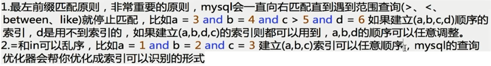

### B-树的应用

- 降低树的高度，减少IO操作的次数

#### MongoDB使用B-树

> B+树内节点不存储数据，所有 data 存储在叶节点导致查询时间复杂度固定为 log n。而B-树查询时间复杂度不固定，与 key 在树中的位置有关，最好为O(1)

- MongoDB 是聚合型数据库，而 B-树恰好 key 和 data 域聚合在一起。
- MongoDB 是以Json格式作为存储的nosql，目的就是高性能，高可用，易扩展
- 使用B-树，所有节点都有Data域，只要找到指定索引就可以进行访问，无疑单次查询平均快于Mysql。


### B+树和索引

- Mysql 是一种关系型数据库，区间访问是常见的一种情况，而 B-树并不支持区间访问（
- B+树由于数据全部存储在叶子节点，并且通过指针串在一起，这样就很容易的进行区间遍历甚至全部遍历

> **B+树叶节点两两相连可大大增加区间访问性，可使用在范围查询等，而B-树每个节点 key 和 data 在一起，则无法区间查找**。

- B+树的查询效率更加稳定，数据全部存储在叶子节点，查询时间复杂度固定为 **O(log n)**。
- B+树更适合外部存储(存储磁盘数据)。由于内节点无 data 域，每个节点能索引的范围更大更精确


### hash索引和BTree索引

**哈希索引的优势：**

- 等值查询。哈希索引具有绝对优势（前提是：没有大量重复键值，如果大量重复键值时，哈希索引的效率很低，因为存在所谓的哈希碰撞问题。）

**哈希索引不适用的场景：**

- 不支持范围查询
- 不支持索引完成排序
- 不支持联合索引的最左前缀匹配规则


### 存储引擎InnoDB和MyISAM

在MySQL 5.5版本前，默认的存储引擎为MyISAM。在那之后MySQL的默认存储引擎改为InnoDB。

- 事务：MySAM不支持事务，InnoDB支持事务
- 锁粒度：MyISAM只有表级锁，InnoDB 支持行级锁
- 外键：InnoDB支持外键，而MyISAM不支持
- 全文索引：MyISAM支持，InnoDB不支持
- 表行数：MyISAM记录表的总行数，会直接取出该值，InnoDB不支持。
- 主键：MyISAM允许没有主键的表存
- 缓存：InnoDB既缓存索引文件，又缓存数据文件；MyISAM只缓存索引文件
- 存储结构：数据和索引的组织方式不同
  - **MyISAM**：每个MyISAM在磁盘上存储成三个文件。分别为：**表定义文件、数据文件、索引文件。**第一个文件的名字以表的名字开始，扩展名指出文件类型。.frm文件存储表定义。数据文件的扩展名为.MYD (MYData)。索引文件的扩展名是.MYI (MYIndex)。
  - **InnoDB：**InnoDB是聚集索引，所有的表都保存在同一个数据文件（.idb）中（也可能是多个文件，或者是独立的表空间文件），InnoDB表的大小只受限于操作系统文件的大小，一般为2GB。

> MySQL的BTree索引使用的是B树中的B+Tree，但对于主要的两种存储引擎的实现方式是不同的。
>
> **MyISAM:** B+Tree叶节点的data域存放的是数据记录的地址
>
> **InnoDB:** 其数据文件本身就是索引文件。相比MyISAM，索引文件和数据文件是分离的，其表数据文件本身就是按B+Tree组织的一个索引结构，树的叶节点data域保存了完整的数据记录。这个索引的key是数据表的主键，因此InnoDB表数据文件本身就是主索引。这被称为“聚簇索引（或聚集索引）”。


### 索引 

避免全表扫描去查找数据，提升检索效率。

#### 常见的索引：

1.添加PRIMARY KEY（主键索引）

```mysql
ALTER TABLE `table_name` ADD PRIMARY KEY ( `column` ) 
```

2.添加UNIQUE(唯一索引)

```mysql
ALTER TABLE `table_name` ADD UNIQUE ( `column` ) 
```

3.添加INDEX(普通索引)

```mysql
ALTER TABLE `table_name` ADD INDEX index_name ( `column` )
```

4.添加FULLTEXT(全文索引)

```mysql
ALTER TABLE `table_name` ADD FULLTEXT ( `column`) 
```

5.添加多列索引

```mysql
ALTER TABLE `table_name` ADD INDEX index_name ( `column1`, `column2`, `column3` )
```


查看索引：

```mysql
SHOW INDEX FROM table_name;
```

**索引原则**：

- 最左前缀原则：如果查询的时候查询条件精确匹配索引的左边连续一列或几列，则此列就可以被用到。

  

- 避免冗余索引：尽量扩展已有的索引而不是创建新索引。


### SQL优化

- 根据**慢日志**定位慢查询sql
- 使用explain等工具分析sql
  - type 
    - all走的全表扫描
  - extra 
    - using filesort 无法利用索引完成的排序成为“文件排序“
    - using temporary 使用临时表 常用于排序order by和分组查询group by
- 修改sql或者尽量让sql走索引


### 事务

#### 事务的特性

- **原子性：** 事务是最小的执行单位，不允许分割。事务的原子性确保动作要么全部完成，要么完全不起作用
- **一致性：** 执行事务前后，数据保持一致，多个事务对同一个数据读取的结果是相同的；
- **隔离性：** 并发访问数据库时，一个用户的事务不被其他事务所干扰，各并发事务之间数据库是独立的；
- **持久性：** 一个事务被提交之后。它对数据库中数据的改变是持久的，即使数据库发生故障也不应该对其有任何影响。

#### 并发事务带来的问题

- **脏读（Dirty read）:** 一个事务读取了另一个事务未提交的数据。
- **丢失修改（Lost to modify）:**一个事务的更新覆盖了另一个事务的更新。
- **不可重复读（Unrepeatableread）:** 一个事务两次读取同一个数据，两次读取的数据不一致。
- **幻读（Phantom read）:** 一个事务两次读取一个范围的记录，两次读取的记录数不一致。
- 不可重复读的重点是修改，幻读的重点在于新增或者删除。

### 事务隔离级别

**SQL 标准定义了四个隔离级别：**

- **READ-UNCOMMITTED(读取未提交)：** 最低的隔离级别，允许读取尚未提交的数据变更，**可能会导致脏读、幻读或不可重复读**。

- **READ-COMMITTED(读取已提交)：** 允许读取并发事务已经提交的数据，**可以阻止脏读，但是幻读或不可重复读仍有可能发生**。

- **REPEATABLE-READ(可重复读)：** 对同一字段的多次读取结果都是一致的，除非数据是被本身事务自己所修改，**可以阻止脏读和不可重复读，但幻读仍有可能发生**。

- **SERIALIZABLE(可串行化)：** 最高的隔离级别，完全服从ACID的隔离级别。所有的事务依次逐个执行，这样事务之间就完全不可能产生干扰，也就是说，**该级别可以防止脏读、不可重复读以及幻读**。

  | 隔离级别         | 脏读 | 不可重复读 | 幻影读 |
  | ---------------- | ---- | ---------- | ------ |
  | READ-UNCOMMITTED | √    | √          | √      |
  | READ-COMMITTED   | ×    | √          | √      |
  | REPEATABLE-READ  | ×    | ×          | √      |
  | SERIALIZABLE     | ×    | ×          | ×      |

  MySQL InnoDB 存储引擎的默认支持的隔离级别是 **REPEATABLE-READ（可重读）**。与 SQL 标准不同的地方在于InnoDB 存储引擎在 **REPEATABLE-READ（可重读）**事务隔离级别下使用的是Next-Key Lock 锁算法，因此可以避免幻读的产生，这与其他数据库系统(如 SQL Server)是不同的。所以说InnoDB 存储引擎的默认支持的隔离级别是 **REPEATABLE-READ（可重读）** 已经可以完全保证事务的隔离性要求，即达到了 SQL标准的**SERIALIZABLE(可串行化)**隔离级别。

  因为隔离级别越低，事务请求的锁越少，所以大部分数据库系统的隔离级别都是**READ-COMMITTED(读取提交内容):**，但是你要知道的是InnoDB 存储引擎默认使用 **REPEATABLE-READ（可重读）**并不会有任何性能损失。

  InnoDB 存储引擎在 **分布式事务** 的情况下一般会用到**SERIALIZABLE(可串行化)**隔离级别。

### 读写分离

https://mp.weixin.qq.com/s/9HwNq9Ip7eXJ42CDMKUHYQ

------