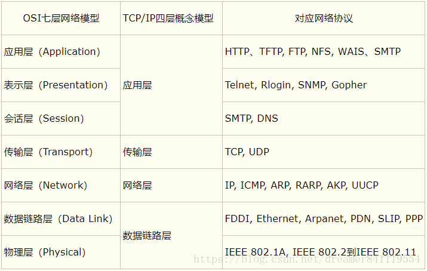
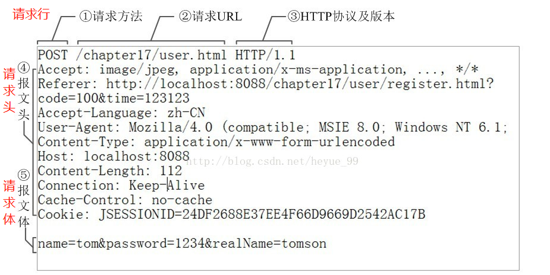

## 1.网络分层

## 2.三次握手

- 客户端–发送带有 SYN 标志的数据包–一次握手–服务端
- 服务端–发送带有 SYN/ACK 标志的数据包–二次握手–客户端
- 客户端–发送带有带有 ACK 标志的数据包–三次握手–服务端

## 3.四次挥手

- 客户端-发送一个 FIN，用来关闭客户端到服务器的数据传送
- 服务器-收到这个 FIN，它发回一个 ACK，确认序号为收到的序号加1 。和 SYN 一样，一个 FIN 将占用一个序号
- 服务器-关闭与客户端的连接，发送一个 FIN 给客户端
- 客户端-发回 ACK 报文确认，并将确认序号设置为收到序号加1

## 4.TCP和UDP

|            | TCP          | UDP        |
| ---------- | ------------ | ---------- |
| 是否连接   | 面向连接     | 面向非连接 |
| 传输可靠性 | 可靠         | 不可靠     |
| 应用场合   | 传输大量数据 | 少量数据   |
| 速度       | 慢           | 快         |

## 5.HTTP状态码

- 1XX：信息状态码，接收的请求正在处理
  - 100：继续，客户端应继续其请求
  - 101：切换协议，服务器根据客户端的请求切换协议。

- 2XX：成功状态码，请求正常处理完毕
  - 200：请求成功
  - 204：请求成功，但无返回内容
  - 206：部分请求成功
- 3XX：重定向状态码，需要进行附加操作以完成请求
  - 301：永久重定向
  - 302：临时重定向

- 4XX：客户端错误，服务器无法处理请求
  - 400：错误请求，服务器无法理解请求
  - 401：未授权
  - 403：禁止，服务器拒绝请求
  - 404：未找到，服务器找不到请求的网页
- 5XX：服务器内部错误，服务器处理请求出错
  - 500：服务器内部错误，服务器遇到错误，无法完成请求。
  - 503：服务不可用，服务器目前无法使用（由于超载或停机维护） 

## 6.URL和URI

- URI(Uniform Resource Identifier) 是统一资源标志符，可以唯一标识一个资源。
- URL(Uniform Resource Location) 是统一资源定位符，可以提供该资源的路径。它是一种具体的 URI，即 URL 可以用来标识一个资源，而且还指明了如何 locate 这个资源。

## 7.HTTPS和HTTP

- HTTP:使用三次TCP握手确认建立一个HTTP连接。
- HTTPS:HTTPS在HTTP的基础上加入了SSL协议，SSL依靠证书来验证服务器的身份，并为浏览器和服务器之间的通信加密。

**http与https的区别：**

1. HTTP 的URL 以http:// 开头，而HTTPS 的URL 以https:// 开头
2. HTTP 是不安全的，而 HTTPS 是安全的
3. HTTP 标准端口是80 ，而 HTTPS 的标准端口是443
4. 在OSI 网络模型中，HTTP工作于应用层，而HTTPS 的安全传输机制工作在传输层
5. HTTP 无法加密，而HTTPS 对传输的数据进行加密
6. HTTP无需证书，而HTTPS 需要CA机构wosign的颁发的SSL证书

## 8.HTTP请求报文

## 9.各种协议与HTTP协议之间的关系

## 10.HTTP 1.0和HTTP 1.1

- 缓存处理：HTTP/1.0 使用 `Pragma:no-cache + Last-Modified/If-Modified-Since`来作为缓存判断的标准；HTTP/1.1 引入了更多的缓存控制策略：`Cache-Control`、`Etag/If-None-Match`等。

-  错误状态管理：HTTP/1.1新增了24个错误状态响应码，如409（Conflict）表示请求的资源与资源的当前状态发生冲突；410（Gone）表示服务器上的某个资源被永久性的删除。

-  范围请求：HTTP/1.1在请求头引入了`range`头域，它允许只请求资源的某个部分，即返回码是206（Partial Content），这样就方便了开发者自由的选择以便于充分利用带宽和连接，支持断点续传。

-  Host头：HTTP1.0中认为每台服务器都绑定一个唯一的IP地址，因此，请求消息中的URL并没有传递主机名（hostname）。但随着虚拟主机技术的发展，在一台物理服务器上可以存在多个虚拟主机（Multi-homed Web Servers），并且它们共享一个IP地址。HTTP1.1的请求消息和响应消息都应支持Host头域，且请求消息中如果没有Host头域会报告一个错误（400 Bad Request）。有了Host字段，就可以将请求发往同一台服务器上的不同网站，为虚拟主机的兴起打下了基础。

- 持久连接：HTTP/1.1 最大的变化就是引入了持久连接（persistent connection），在HTTP/1.1中默认开启 `Connection: keep-alive`，即TCP连接默认不关闭，可以被多个请求复用。
> 客户端和服务器发现对方一段时间没有活动，就可以主动关闭连接。不过，规范的做法是，客户端在最后一个请求时，发送Connection: close，明确要求服务器关闭TCP连接。

- 管道机制：HTTP/1.1中引入了管道机制（pipelining）,即在同一个TCP连接中，客户端可以**同时**发送多个请求。

## 11.SSL/TLS运行机制

SSL/TLS的基本思路是公钥加密法：客户端先向服务器索要并验证公钥，然后用公钥加密传输来协商生成“对话秘钥”（非对称加密），双方采用“对话秘钥”进行加密通信（对称加密）。

通信过程如下：

1. 客户端发出请求：给出支持的协议版本、支持的加密方法（如RSA公钥加密）以及一个客户端生成的随机数（Client random）；

2. 服务端回应：确认双方通信的协议版本、加密方法，并给出服务器证书以及一个服务器生成的随机数（Server random）；

3. 客户端回应：客户端确认证书有效，取出证书中的公钥，然后生成一个新的随机数（Premaster secret），使用公钥加密这个随机数，发送给服务端；

4. 服务端回应：服务端使用自己的私钥解密客户端发来的随机数（Premaster secret），客户端和服务端根据约定的加密方法，使用三个随机数，生成“对话秘钥”；

5. 会话通信：客户端和服务端使用“对话秘钥”加密通信，这个过程完全使用普通的HTTP协议，只不过用“会话秘钥”加密内容。

