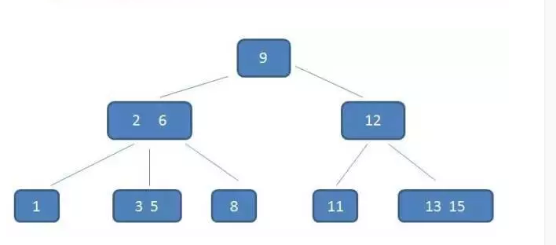
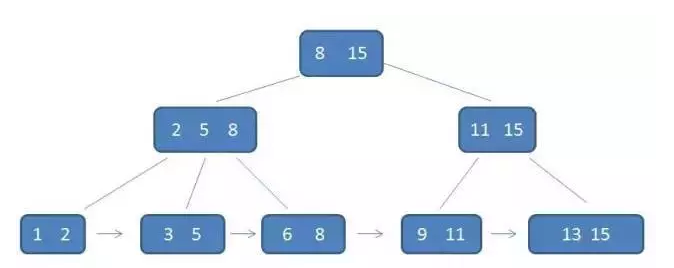

## 二叉树

### 二叉树的性质

- 深度为 k的 二叉树至多有2^k-1个结点
- 包含n个结点的二叉树的高度至少为log2(n+1)

### 满二叉树

**定义**：高度为h，并且有2^k-1个结点的二叉树

### 完全二叉树

- 所有叶子节点都出现在 k 或者 k-1 层，而且从 1 到 k-1 层必须达到最大节点数
- 第 k 层可以不是满的，但是第 k 层的所有节点必须集中在最左边。


使用场景：堆排序

> 一棵满二叉树必定是一棵完全二叉树，而完全二叉树未必是满二叉树。

### 二叉查找树(二叉搜索，BST)

- 若任意节点的左子树不空，则左子树上所有节点的值均小于它的根节点的值；
- 若任意节点的右子树不空，则右子树上所有节点的值均大于它的根节点的值；
- 任意节点的左、右子树也分别为二叉查找树；
- 没有键值相等的节点。

> 查找最好时间复杂度O(logN)，最坏时间复杂度O(N)。

### 平衡二叉树（AVL）：

- 在二叉查找树的基础上，树的左右两边的层级数相差不会大于1;

> **查找**的时间复杂度维持在O(logN)，不会出现最差情况

### 红黑树

- 每个节点要么是红色，要么是黑色；
- 根节点永远是黑色的；
- 所有的叶节点都是是黑色的（注意这里说叶子节点其实是上图中的 NIL 节点）；
- 每个红色节点的两个子节点一定都是黑色；
- 从任一节点到其子树中每个叶子节点的路径都包含相同数量的黑色节点

> 红黑树相对于AVL树来说，牺牲了部分平衡性以换取插入/删除操作时少量的旋转操作，整体来说性能要优于AVL树。

### B树（B-树，不是减，只是符号）

平衡多路查找树，一般用字母m表示阶数。当m取2时，就是我们常见的二叉搜索树。

- 根结点至少有两个子女。
- 每个中间节点都包含k-1个元素和k个孩子，其中 m/2 <= k <= m
- 每一个叶子节点都包含k-1个元素，其中 m/2 <= k <= m
- 所有的叶子结点都位于同一层。
- 每个节点中的元素从小到大排列，节点当中k-1个元素正好是k个孩子包含的元素的值域分划。

B树减少定位记录时所经历的中间过程，从而加快存取速度。B树这种数据结构可以用来描述外部存储。这种数据结构常被应用在数据库（MongoDB）和文件系统的实现上。

> 数据库索引是存储在磁盘上的，当数据量大时，就不能把整个索引全部加载到内存了，只能逐一加载每一个磁盘页（对应索引树的节点）。所以我们要减少IO次数，对于树来说，IO次数就是树的高度，而“矮胖”就是b树的特征之一，它的每个节点最多包含m个孩子，m称为b树的阶，m的大小取决于磁盘页的大小。



### B+树

- 有k个子树的中间节点包含有k个元素（B树中是k-1个元素），每个元素不保存数据，只用来索引，所有数据都保存在叶子节点。
- 所有的叶子结点中包含了全部元素的信息，及指向含这些元素记录的指针，且叶子结点本身依关键字的大小自小而大顺序链接。
- 所有的中间节点元素都同时存在于子节点，在子节点元素中是最大（或最小）元素。




**B+树的优势：**

- B+树的中间节点不保存数据，所以磁盘页能容纳更多节点，更“矮胖”，使得查询的IO次数更少。
- 所有查询都要查找到叶子节点，查询性能稳定。
- 所有叶子节点形成有序链表，便于范围查询。

### B-树和B+树的区别

- B+树内节点不存储数据，所有数据存储在叶节点导致查询时间复杂度固定为 log n。
- B-树查询时间复杂度不固定，与 key 在树中的位置有关，最好为O(1)。
- B+树叶节点两两相连可大大增加区间访问性，可使用在范围查询等。
- B-树每个节点 key 和 data 在一起，则无法区间查找。
- B+树更适合外部存储(存储磁盘数据)。由于内节点无 data 域，每个节点能索引的范围更大更精确。


## 排序算法

### 冒泡排序

```java
public static void bubbleSort(int[] arr) {
    int temp = 0;
    for (int i = arr.length - 1; i > 0; --i) { // 每次需要排序的长度
        for (int j = 0; j < i; ++j) { // 从第一个元素到第i个元素
            if (arr[j] > arr[j + 1]) {
                temp = arr[j];
                arr[j] = arr[j + 1];
                arr[j + 1] = temp;
            }
        }
    }
}


//优化
public static void bubbleSort(int[] arr) {
    int temp = 0;
    boolean isOrdered = false;
    for (int i = arr.length - 1; i > 0; --i) { // 每次需要排序的长度
        //用于标识是否已经将序列排好序
        boolean isOrdered = true;
        for (int j = 0; j < i; ++j) { // 从第一个元素到第i个元素
            if (arr[j] > arr[j + 1]) {
                temp = arr[j];
                arr[j] = arr[j + 1];
                arr[j + 1] = temp;
                //如果出现有元素交换，则表明此躺可能没有完成排序
                isOrdered = false;
            }
        }
        //如果当前趟都没有进行元素的交换，证明前面一趟比较已经排好序，直接跳出循环
        if (isOrdered) {
                break;
        }
    }
}
```


### 快排


## 二分查找

### 递归

```java
int binarysearch(int array[], int low, int high, int target) {
    if (low > high) return -1;
    int mid = low + (high - low) / 2;
    if (array[mid] > target)
        return binarysearch(array, low, mid - 1, target);
    if (array[mid] < target)
        return binarysearch(array, mid + 1, high, target);
    return mid;
}
```

### 非递归

```java
int binarysearch(int a[], int key) {
    int low = 0;
    int high = a.length - 1;
    while (low <= high) {
        int mid = low + (high - low) / 2;
        if (a[mid] > key)
            high = mid - 1;
        else if (a[mid] < key)
            low = mid + 1;
        else
            return mid;
    }
    return -1;
}
```


