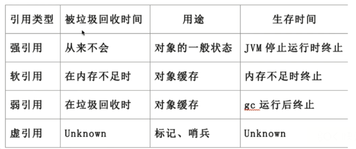
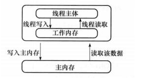
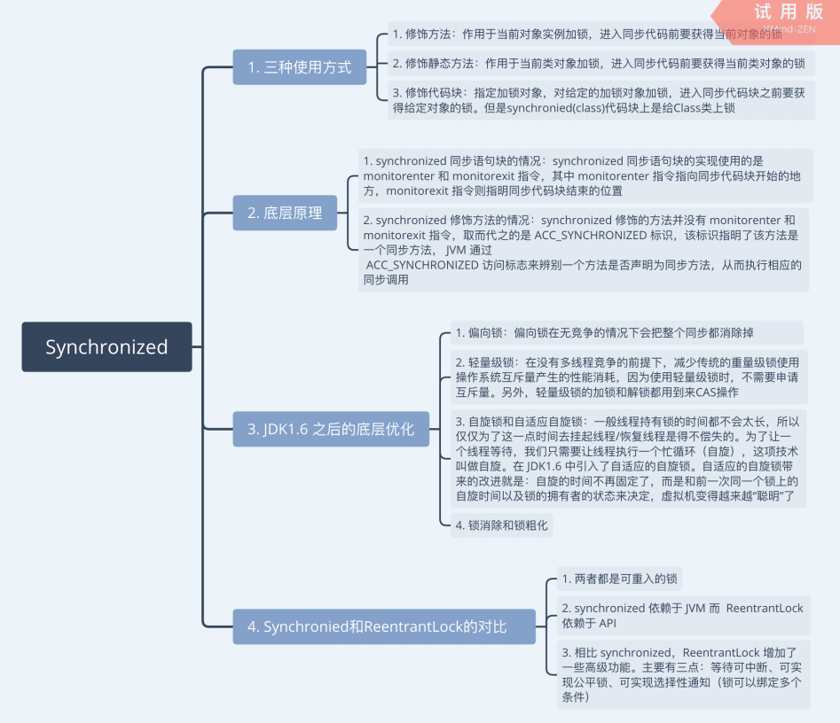
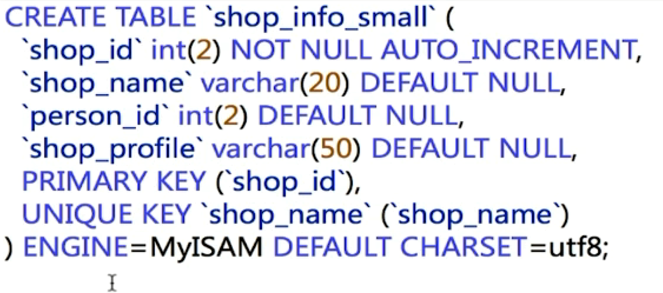
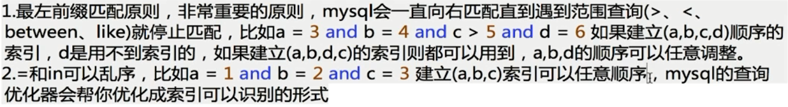
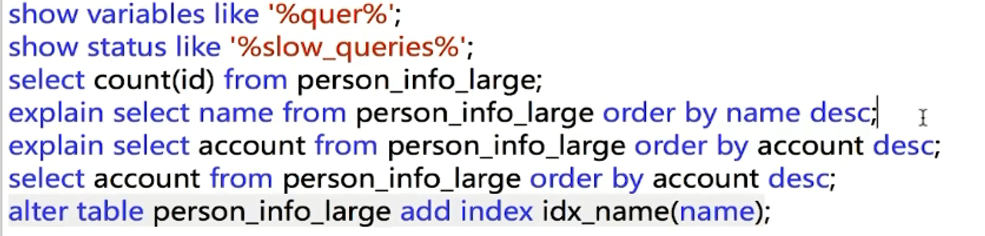
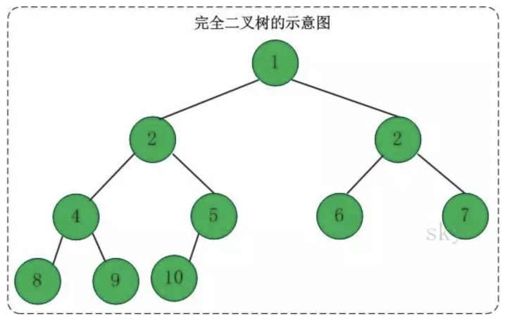
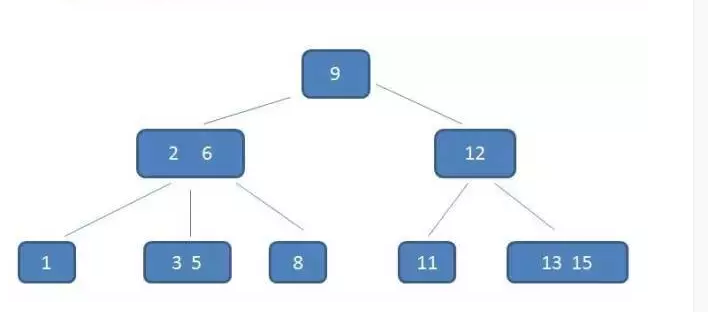
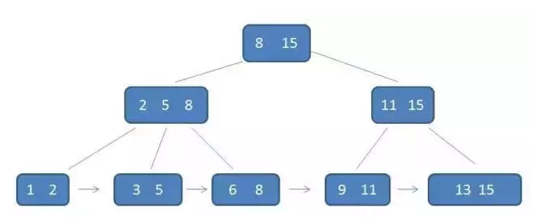
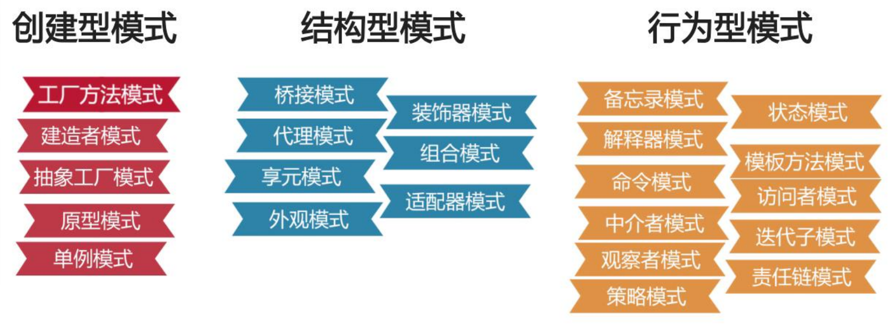

# Java基础

hashmap

ArrayList和LinkedList

List和Set

equals和hashCode

---

# Java高级

AIO,NIO与BIO的区别

---

# JVM

### 运行时的数据区域

**线程私有的：**

- 程序计数器 **为了线程切换后能恢复到正确的执行位置**
- 虚拟机栈 **局部变量表**
- 本地方法栈  **Native 方法**

**线程共享的：**

- 堆 **存放对象实例**
- 方法区 **已被虚拟机加载的类信息、常量、静态变量**
- 直接内存 (非运行时数据区的一部分)


### 垃圾判断（对象回收判断）

- 引用计数算法 **在对象头中分配一个空间来保存该对象被引用的次数**
- 可达性分析算法 **当一个对象到 GC Roots 没有任何引用链相连，则对象不可用**


### 垃圾回收算法

- 标记清理算法 内存碎片问题
- 复制算法   平分代价太高
- 标记整理算法  内存变动频繁，效率低
- 分代收集算法  新生代  少量存活 用复制算法 老年代 用标记清理或整理算法


### 垃圾回收过程

- 新生代

  - Eden区 对象会在新生代 Eden 区中进行分配，当 Eden 区没有足够空间进行分配时，虚拟机会发起一次 Minor GC
  - Survivor区 无需回收的存活对象，将会进到 Survivor 
    - Form区
    - To区  设置两个 Survivor 区最大的好处就是解决内存碎片化

- 老年代

  经历15次MinorGC存活的对象

  

### 垃圾收集器

- Serial 收集器
- parNew收集器
- Parallel Scavenge 收集器
- CMS收集器 标记-清除算法
- G1收集器 复制+标记-整理算法 ；年轻代和老年代不再物理隔离


### Java中的强引用、软引用、弱引用、虚引用

**强引用** 

在程序代码中普遍存在的，类似 Object obj = new Object() 这类引用，只要强引用还存在，垃圾收集器永远不会回收掉被引用的对象。 

**软引用** 

用来描述一些还有用但并非必须的对象。对于软引用关联着的对象，在系统将要发生内存溢出异常之前，将会把这些对象列进回收范围之中进行第二次回收。如果这次回收后还没有足够的内存，才会抛出内存溢出异常。 

 **弱引用** 

也是用来描述非必需对象的，但是它的强度比软引用更弱一些，被弱引用关联的对象只能生存到下一次垃圾收集发生之前。当垃圾收集器工作时，无论当前内存是否足够，都会回收掉只被弱引用关联的对象。 

**虚引用** 

也叫幽灵引用或幻影引用，是最弱的一种引用关系。一个对象是否有虚引用的存在，完全不会对其生存时间构成影响，也无法通过虚引用来取得一个对象实例。它的作用是能在这个对象被收集器回收时收到一个系统通知。 




#### 内存泄漏

内存泄漏就是存在一些不会再被使用确没有被回收的对象

- 静态集合类引起的内存泄漏‘

- 各种连接没有显示关闭

- 内部类：内部类的引用是比较容易遗忘的一种，而且一旦没释放可能导致一系列的后继 

  类对象没有释放 

### 类加载

**虚拟机把描述类的数据从 Class 文件加载到内存，并对数据进行校验、转换解析和初始化，最终形成可以被虚拟机直接使用的 Java 类型，这就是虚拟机的类加载机制。** 

- 加载
- 验证
- 准备 **准备阶段是正式为类变量分配内存并设置类变量初始值的阶段**
- 解析 **解析阶段是虚拟机将常量池内的符号引用替换为直接引用的过程**
- 初始化


### 类加载器

1. **BootstrapClassLoader(启动类加载器)** ：最顶层的加载类，由C++实现，负责加载 `%JAVA_HOME%/lib`目录下的jar包和类或者或被 `-Xbootclasspath`参数指定的路径中的所有类。
2. **ExtensionClassLoader(扩展类加载器)** ：主要负责加载目录 `%JRE_HOME%/lib/ext` 目录下的jar包和类，或被 `java.ext.dirs` 系统变量所指定的路径下的jar包。
3. **AppClassLoader(应用程序类加载器)** :面向我们用户的加载器，负责加载当前应用classpath下的所有jar包和类。

### 双亲委派模型

如果一个类加载器收到了类加载请求，它首先不会自己去尝试加载这个类，而是把这个请求委派给父类加载器去完成。每一个层次的类加载器都是如此，因此所有的加载请求最终都应该传送到顶层的启动类加载器中，只有当父类加载器反馈自己无法完成这个加载请求（它的搜索范围中没有找到所需的类）时，子加载器才会尝试自己去加载。 

**好处**

双亲委派模型保证了Java程序的稳定运行，可以避免类的重复加载（JVM 区分不同类的方式不仅仅根据类名，相同的类文件被不同的类加载器加载产生的是两个不同的类），也保证了 Java 的核心 API 不被篡改。


---

# 多线程

### 进程和线程的区别	

- 线程 是 进程 划分成的更小的运行单位

- 一个进程中可以有多个线程，多个线程共享进程的**堆**和**方法区 (JDK1.8 之后的元空间)**资源

- 但是每个线程有自己的**程序计数器**、**虚拟机栈** 和 **本地方法栈**。


### 线程创建的方式

- 继承Thread类并重写run的方法

- 实现Runnable接口的run方法

- 实现Callable接口的call方法

  

### Java内存模型



### Synchronized

synchronized关键字可以保证被它修饰的方法或者代码块在任意时刻只能有一个线程执行。



### volatile

保证变量的可见性,防止指令重排序,不能保证原子性


Lock

### ThreadLocal

**每一个线程都有自己的专属本地变量**


## 线程池

- **降低资源消耗。** 通过重复利用已创建的线程降低线程创建和销毁造成的消耗。
- **提高响应速度。** 当任务到达时，任务可以不需要的等到线程创建就能立即执行。
- **提高线程的可管理性**

ThreadPoolExecutor 创建

- **FixedThreadPool** ： 该方法返回一个固定线程数量的线程池。
- **SingleThreadExecutor：** 方法返回一个只有一个线程的线程池。
- **CachedThreadPool：** 该方法返回一个可根据实际情况调整线程数量的线程池。


### 原子类

- AtomicInteger：整形原子类
- AtomicLong：长整型原子类
- AtomicBoolean：布尔型原子类


### CAS

CAS的原理是拿期望的值和原本的一个值作比较，如果相同则更新成新的值 Compare And Swap

阻塞队列

### ABA 问题

A-B-A可能修改过


### 悲观锁和乐观锁

- 悲观锁：每次拿数据都上锁
- 乐观锁：不上锁


### 线程状态及转换


> Object 方法 wait() wait(long) wait(long,int) notify() notifyAll()

> Thread 方法 start() join() join(long) join(long,int)  sleep() yield() interrupt()

#### sleep() 方法和 wait() 方法

- 两者都可以暂停线程的执行，wait 通常被用于线程间交互/通信，sleep 通常被用于暂停执行。
- `wait`是Object的方法，而`sleep`是Thread的方法。
- `sleep`方法不会释放锁，可以定义时间，时间过后会自动唤醒。`sleep(milliseconds)`可以用时间指定使它自动唤醒，如果时间不到，只能用`interrupt()`强行打断。
- `wait`方法会释放锁。 `sleep`不会释放资源，`wait`进入线程等待池等待，出让系统资源，其它线程可以占用CPU，要等待其它线程调用`notify`或`notifyAll`唤醒等待池中所有线程，才会进入就绪队列等待OS分配系统资源.
- `wait`、`notify`、`notifyAll`只能在同步控制方法或同步控制块中使用，而`sleep`可以任何地方使用。

#### notify()

唤醒因调用这个对象wait()方法而阻塞的线程，随机。

#### notifyAll()

唤醒全部

#### yield()

让线程让出CPU使用权，在大多数情况下，yield()将导致线程从运行状态转到可运行状态，但有可能没有效果。

#### join()

等待其他线程终止。在当前线程中调用另一个线程的join()方法，则当前线程转入阻塞状态，直到另一个进程运行结束，当前线程再由阻塞转为就绪状态。

> *在很多情况下，主线程生成并起动了子线程，如果子线程里要进行大量的耗时的运算，主线程往往将于子线程之前结束，但是如果主线程处理完其他的事务后，需要用到子线程的处理结果，也就是主线程需要等待子线程执行完成之后再结束，这个时候就要用到 join() 方法了。*

#### interrupt()

中断

如果线程处于被阻塞状态（例如处于sleep, wait, join 等状态），那么线程将立即退出被阻塞状态，并抛出一个InterruptedException异常。

如果线程处于正常活动状态，那么会将该线程的中断标志设置为 true，仅此而已。被设置中断标志的线程将继续正常运行，不受影响


协程

ThreadLocal

ThreadLocalMap

wait和sleep

线程池的参数

线程安全

ReentrantLock


### 避免死锁的方案，如何排查死锁

线程 A 持有资源 2，线程 B 持有资源 1，他们同时都想申请对方的资源，所以这两个线程就会互相等待而进入死锁状态。

- 互斥这个条件我们没有办法破坏，因为我们用锁为的就是互斥。
- 对于“占用且等待”这个条件，我们可以**一次性申请**所有的资源，这样就不存在等待了。
- 对于“不可抢占”这个条件，占用部分资源的线程进一步申请其他资源时，如果申请不到，可以**主动释放**它占有的资源，这样不可抢占这个条件就破坏掉了。
- 对于“循环等待”这个条件，可以靠**按序申请资源**来预防。所谓按序申请，是指资源是有线性顺序的。

**死锁检测**

- jps+jstack命令

- JConsole工具

  

### 上下文切换

**任务从保存到再加载的过程就是一次上下切换。**

**减少上下文切换**

- **无锁并发编程**。多线程竞争时，会引起上下文切换，所以多线程处理数据时，可以用一些办法来避免使用锁，如将数据的**ID**按照Hash取模分段，不同的线程处理不同段的数据
- **使用最少线程**。避免创建不需要的线程，比如任务很少，但是创建了很多线程来处理，这样会造成大量线程都处于等待状态
- **CAS 算法**。Java的Atomic包使用CAS算法来更新数据，而不需要加锁

---

# Spring

IoC（Inverse of Control:控制反转）是一种**设计思想**，就是 **将原本在程序中手动创建对象的控制权，交由Spring框架来管理。**

AOP(Aspect-Oriented Programming:面向切面编程)能够将那些与业务无关，**却为业务模块所共同调用的逻辑或责任（例如事务处理、日志管理、权限控制等）封装起来**，便于**减少系统的重复代码**，**降低模块间的耦合度**，并**有利于未来的可拓展性和可维护性**。


---

# 计算机网络

Cookie和Session

HTTP 2.0 和 HTTP 1.1

TCP流量控制和拥塞控制

状态码

3次握手，4次挥手

长连接，短连接

TCP和UDP

https

---

---

# 网络安全

### SQL注入

所谓SQL注入，就是通过把 SQL 命令插入到 Web 表单提交或输入域名或页面请求的查询字符串，最终达到欺骗服务器执行恶意的 SQL 命令

```mysql
select * from users where username = '' or 1 = 1#' and password=md5('')
```

**防止SQL注入**

- JDBC参数化查询

  ```mysql
  String sql = "SELECT * FROM users WHERE name= ? ";
  PreparedStatement ps = connection.prepareStatement(sql);
  // 参数 index 从 1 开始
  ps.setString(1, name);
  ```

- Mybatis 尽量不使用`${}`

  使用 `#{}` 语法时，MyBatis 会自动生成 `PreparedStatement`

### XSS（跨站脚本攻击）攻击

XSS 攻击通常指黑客通过 "HTML 注入" 篡改了页面，插入了恶意脚本。XSS的攻击目标是为了盗取客户端的 cookie 或者其他网站用于识别客户端身份的敏感信息。获取到合法用户的信息后，攻击者甚至可以假冒最终用户与网站进行交互。


### CSRF（跨站请求伪造）攻击

跨站请求攻击，简单地说，是攻击者通过一些技术手段欺骗用户的浏览器去访问一个自己曾经认证过的网站并运行一些操作（如发邮件，发消息，甚至财产操作如转账和购买商品）。由于浏览器曾经认证过，所以被访问的网站会认为是真正的用户操作而去运行。

**防范措施**

- 检查Referer头：这个字段用以标明请求来源于哪个地址，如果是 CSRF 攻击传来的请求，Referer 字段会是包含恶意网址的地址。

- 添加校验Token：可以在 HTTP 请求中以参数的形式加入一个随机产生的 token，并在服务器端建立一个拦截器来验证这个 token。

  

### DoS（拒接服务）攻击

是一种简单的破坏性攻击。通常是利用传输协议下的某个弱点、系统存在的漏洞、或服务器的漏洞。对目标系统发起大规模的进攻。用超出目标处理能力的海量数据包消耗可用系统资源、宽带资源等，造成程序缓冲区溢出错误，使其他合法用户无法正常请求。最终致使网络服务瘫痪，甚至系统死机

---

---

# Mysql

### B-树的应用

- 降低树的高度，减少IO操作的次数

#### MongoDB使用B-树

> B+树内节点不存储数据，所有 data 存储在叶节点导致查询时间复杂度固定为 log n。而B-树查询时间复杂度不固定，与 key 在树中的位置有关，最好为O(1)

- MongoDB 是聚合型数据库，而 B-树恰好 key 和 data 域聚合在一起。
- MongoDB 是以Json格式作为存储的nosql，目的就是高性能，高可用，易扩展

- 使用B-树，所有节点都有Data域，只要找到指定索引就可以进行访问，无疑单次查询平均快于Mysql。


### B+树和索引

- Mysql 是一种关系型数据库，区间访问是常见的一种情况，而 B-树并不支持区间访问（

- B+树由于数据全部存储在叶子节点，并且通过指针串在一起，这样就很容易的进行区间遍历甚至全部遍历

> **B+树叶节点两两相连可大大增加区间访问性，可使用在范围查询等，而B-树每个节点 key 和 data 在一起，则无法区间查找**。

- B+树的查询效率更加稳定，数据全部存储在叶子节点，查询时间复杂度固定为 **O(log n)**。

- B+树更适合外部存储(存储磁盘数据)。由于内节点无 data 域，每个节点能索引的范围更大更精确


### hash索引和BTree索引

**哈希索引的优势：**

- 等值查询。哈希索引具有绝对优势（前提是：没有大量重复键值，如果大量重复键值时，哈希索引的效率很低，因为存在所谓的哈希碰撞问题。）

**哈希索引不适用的场景：**

- 不支持范围查询

- 不支持索引完成排序

- 不支持联合索引的最左前缀匹配规则


### 存储引擎InnoDB和MyISAM

在MySQL 5.5版本前，默认的存储引擎为MyISAM。在那之后MySQL的默认存储引擎改为InnoDB。

- 事务：MySAM不支持事务，InnoDB支持事务
- 锁粒度：MyISAM只有表级锁，InnoDB 支持行级锁
- 外键：InnoDB支持外键，而MyISAM不支持
- 全文索引：MyISAM支持，InnoDB不支持
- 表行数：MyISAM记录表的总行数，会直接取出该值，InnoDB不支持。
- 主键：MyISAM允许没有主键的表存
- 缓存：InnoDB既缓存索引文件，又缓存数据文件；MyISAM只缓存索引文件
- 存储结构：数据和索引的组织方式不同
  - **MyISAM**：每个MyISAM在磁盘上存储成三个文件。分别为：**表定义文件、数据文件、索引文件。**第一个文件的名字以表的名字开始，扩展名指出文件类型。.frm文件存储表定义。数据文件的扩展名为.MYD (MYData)。索引文件的扩展名是.MYI (MYIndex)。
  - **InnoDB：**InnoDB是聚集索引，所有的表都保存在同一个数据文件（.idb）中（也可能是多个文件，或者是独立的表空间文件），InnoDB表的大小只受限于操作系统文件的大小，一般为2GB。

> MySQL的BTree索引使用的是B树中的B+Tree，但对于主要的两种存储引擎的实现方式是不同的。
>
> **MyISAM:** B+Tree叶节点的data域存放的是数据记录的地址
>
> **InnoDB:** 其数据文件本身就是索引文件。相比MyISAM，索引文件和数据文件是分离的，其表数据文件本身就是按B+Tree组织的一个索引结构，树的叶节点data域保存了完整的数据记录。这个索引的key是数据表的主键，因此InnoDB表数据文件本身就是主索引。这被称为“聚簇索引（或聚集索引）”。


### 索引 

避免全表扫描去查找数据，提升检索效率。

#### 常见的索引：

1.添加PRIMARY KEY（主键索引）

```mysql
ALTER TABLE `table_name` ADD PRIMARY KEY ( `column` ) 
```

2.添加UNIQUE(唯一索引)

```mysql
ALTER TABLE `table_name` ADD UNIQUE ( `column` ) 
```

3.添加INDEX(普通索引)

```mysql
ALTER TABLE `table_name` ADD INDEX index_name ( `column` )
```

4.添加FULLTEXT(全文索引)

```mysql
ALTER TABLE `table_name` ADD FULLTEXT ( `column`) 
```

5.添加多列索引

```mysql
ALTER TABLE `table_name` ADD INDEX index_name ( `column1`, `column2`, `column3` )
```



查看索引：

```mysql
SHOW INDEX FROM table_name;
```

**索引原则**：

- 最左前缀原则：如果查询的时候查询条件精确匹配索引的左边连续一列或几列，则此列就可以被用到。

  

- 避免冗余索引：尽量扩展已有的索引而不是创建新索引。


### SQL优化

- 根据**慢日志**定位慢查询sql

- 使用explain等工具分析sql

  - type 
    - all走的全表扫描

  - extra 
    - using filesort 无法利用索引完成的排序成为“文件排序“
    - using temporary 使用临时表 常用于排序order by和分组查询group by

- 修改sql或者尽量让sql走索引




### 事务

#### 事务的特性

- **原子性：** 事务是最小的执行单位，不允许分割。事务的原子性确保动作要么全部完成，要么完全不起作用
- **一致性：** 执行事务前后，数据保持一致，多个事务对同一个数据读取的结果是相同的；
- **隔离性：** 并发访问数据库时，一个用户的事务不被其他事务所干扰，各并发事务之间数据库是独立的；
- **持久性：** 一个事务被提交之后。它对数据库中数据的改变是持久的，即使数据库发生故障也不应该对其有任何影响。

#### 并发事务带来的问题

- **脏读（Dirty read）:** 一个事务读取了另一个事务未提交的数据。
- **丢失修改（Lost to modify）:**一个事务的更新覆盖了另一个事务的更新。
- **不可重复读（Unrepeatableread）:** 一个事务两次读取同一个数据，两次读取的数据不一致。
- **幻读（Phantom read）:** 一个事务两次读取一个范围的记录，两次读取的记录数不一致。
- 不可重复读的重点是修改，幻读的重点在于新增或者删除。

### 事务隔离级别

**SQL 标准定义了四个隔离级别：**

- **READ-UNCOMMITTED(读取未提交)：** 最低的隔离级别，允许读取尚未提交的数据变更，**可能会导致脏读、幻读或不可重复读**。

- **READ-COMMITTED(读取已提交)：** 允许读取并发事务已经提交的数据，**可以阻止脏读，但是幻读或不可重复读仍有可能发生**。

- **REPEATABLE-READ(可重复读)：** 对同一字段的多次读取结果都是一致的，除非数据是被本身事务自己所修改，**可以阻止脏读和不可重复读，但幻读仍有可能发生**。

- **SERIALIZABLE(可串行化)：** 最高的隔离级别，完全服从ACID的隔离级别。所有的事务依次逐个执行，这样事务之间就完全不可能产生干扰，也就是说，**该级别可以防止脏读、不可重复读以及幻读**。

  | 隔离级别         | 脏读 | 不可重复读 | 幻影读 |
  | ---------------- | ---- | ---------- | ------ |
  | READ-UNCOMMITTED | √    | √          | √      |
  | READ-COMMITTED   | ×    | √          | √      |
  | REPEATABLE-READ  | ×    | ×          | √      |
  | SERIALIZABLE     | ×    | ×          | ×      |

  MySQL InnoDB 存储引擎的默认支持的隔离级别是 **REPEATABLE-READ（可重读）**。与 SQL 标准不同的地方在于InnoDB 存储引擎在 **REPEATABLE-READ（可重读）**事务隔离级别下使用的是Next-Key Lock 锁算法，因此可以避免幻读的产生，这与其他数据库系统(如 SQL Server)是不同的。所以说InnoDB 存储引擎的默认支持的隔离级别是 **REPEATABLE-READ（可重读）** 已经可以完全保证事务的隔离性要求，即达到了 SQL标准的**SERIALIZABLE(可串行化)**隔离级别。

  因为隔离级别越低，事务请求的锁越少，所以大部分数据库系统的隔离级别都是**READ-COMMITTED(读取提交内容):**，但是你要知道的是InnoDB 存储引擎默认使用 **REPEATABLE-READ（可重读）**并不会有任何性能损失。

  InnoDB 存储引擎在 **分布式事务** 的情况下一般会用到**SERIALIZABLE(可串行化)**隔离级别。

###  读写分离

https://mp.weixin.qq.com/s/9HwNq9Ip7eXJ42CDMKUHYQ

---

---

# Redis

如何保证Redis与数据库的数据一致性

---

# Linux

操作命令

---

---

# 消息队列

### 消息队列的使用场景

- **应用解耦** ：不关心处理

  多应用间通过消息队列对同一消息进行处理，避免调用接口失败导致整个过程失败；

- **异步处理**：并行，提速

  多应用对消息队列中同一消息进行处理，应用间并发处理消息，相比串行处理，减少处理时间；

- **流量削峰**：缓冲，秒杀

  通过异步处理，将短时间高并发产生的事务消息存储在消息队列中，从而削平高峰期的并发事务。

### 消息队列的带来的问题

- **系统可用性降低：**考虑消息丢失或者说MQ挂掉等等的情况
- **系统复杂性提高：** 会出现重复消费、处理消息丢失的情况、保证消息传递的顺序性等问题！
- **一致性问题：** 消息的消费者并没有正确消费消息就会导致数据不一致的情况了

### JMS和AMQP

### 1. 点对点模型（P2P）

- 使用**队列（Queue）**作为消息通信载体；满足**生产者与消费者模式**，一条消息只能被一个消费者使用，未被消费的消息在队列中保留直到被消费或超时。

> 如果希望每个消息都会被成功处理，使用P2P模型

### 2. 发布/订阅模型（Pub/Sub）

- 发布订阅模型（Pub/Sub） 使用**主题（Topic）**作为消息通信载体，类似于**广播模式**；发布者发布一条消息，该消息通过主题传递给所有的订阅者，**在一条消息广播之后才订阅的用户则是收不到该条消息的**。

> 如果希望发送的消息可以被多个消费者处理的话，那么可以采用Pub/Sub模式。


### 如何保证消息不被重复消费

Kafka 实际上有个 offset 的概念，就是每个消息写进去，都有一个 offset，代表消息的序号，然后 consumer 消费了数据之后，每隔一段时间（定时定期），会把自己消费过的消息的 offset 提交一下，表示“我已经消费过了，下次我要是重启啥的，你就让我继续从上次消费到的 offset 来继续消费吧”。

**消费者offset没来得及提交就会造成重复消费**

幂等性，通俗点说，就一个数据，或者一个请求，给你重复来多次，你得确保对应的数据是不会改变的，不能出错。

**怎么保证消息队列消费的幂等性？**

要保证消息的幂等性，这个要结合业务的类型来进行处理。下面提供几个思路供参考：

- 可在内存中维护一个set，只要从消息队列里面获取到一个消息，先查询这个消息在不在set里面，如果在表示已消费过，直接丢弃；如果不在，则在消费后将其加入set当中。
- 如何要写数据库，可以拿唯一键先去数据库查询一下，如果不存在在写，如果存在直接更新或者丢弃消息。
- 如果是写redis那没有问题，每次都是set，天然的幂等性。
- 让生产者发送消息时，每条消息加一个全局的唯一id，然后消费时，将该id保存到redis里面。消费时先去redis里面查一下有么有，没有再消费。
- 数据库操作可以设置唯一键，防止重复数据的插入，这样插入只会报错而不会插入重复数据。

---

---

# 分布式

分布式锁

CAP

分布式事务

MQ

---

# 数据结构和算法

## 二叉树

### 二叉树的性质

- 深度为 k的 二叉树至多有2^k-1个结点
- 包含n个结点的二叉树的高度至少为log2(n+1)

### 满二叉树

**定义**：高度为h，并且有2^k-1个结点的二叉树

### 完全二叉树

- 所有叶子节点都出现在 k 或者 k-1 层，而且从 1 到 k-1 层必须达到最大节点数
- 第 k 层可以不是满的，但是第 k 层的所有节点必须集中在最左边。



使用场景：堆排序

> 一棵满二叉树必定是一棵完全二叉树，而完全二叉树未必是满二叉树。

### 二叉查找树(二叉搜索，BST)

- 若任意节点的左子树不空，则左子树上所有节点的值均小于它的根节点的值；

- 若任意节点的右子树不空，则右子树上所有节点的值均大于它的根节点的值；

- 任意节点的左、右子树也分别为二叉查找树；

- 没有键值相等的节点。

> 查找最好时间复杂度O(logN)，最坏时间复杂度O(N)。

### 平衡二叉树（AVL）：

- 在二叉查找树的基础上，树的左右两边的层级数相差不会大于1;

> **查找**的时间复杂度维持在O(logN)，不会出现最差情况

### 红黑树

- 每个节点要么是红色，要么是黑色；

- 根节点永远是黑色的；

- 所有的叶节点都是是黑色的（注意这里说叶子节点其实是上图中的 NIL 节点）；

- 每个红色节点的两个子节点一定都是黑色；

- 从任一节点到其子树中每个叶子节点的路径都包含相同数量的黑色节点

> 红黑树相对于AVL树来说，牺牲了部分平衡性以换取插入/删除操作时少量的旋转操作，整体来说性能要优于AVL树。

### B树（B-树，不是减，只是符号）

平衡多路查找树，一般用字母m表示阶数。当m取2时，就是我们常见的二叉搜索树。

- 根结点至少有两个子女。

- 每个中间节点都包含k-1个元素和k个孩子，其中 m/2 <= k <= m

- 每一个叶子节点都包含k-1个元素，其中 m/2 <= k <= m

- 所有的叶子结点都位于同一层。

- 每个节点中的元素从小到大排列，节点当中k-1个元素正好是k个孩子包含的元素的值域分划。

B树减少定位记录时所经历的中间过程，从而加快存取速度。B树这种数据结构可以用来描述外部存储。这种数据结构常被应用在数据库（MongoDB）和文件系统的实现上。

> 数据库索引是存储在磁盘上的，当数据量大时，就不能把整个索引全部加载到内存了，只能逐一加载每一个磁盘页（对应索引树的节点）。所以我们要减少IO次数，对于树来说，IO次数就是树的高度，而“矮胖”就是b树的特征之一，它的每个节点最多包含m个孩子，m称为b树的阶，m的大小取决于磁盘页的大小。



### B+树

- 有k个子树的中间节点包含有k个元素（B树中是k-1个元素），每个元素不保存数据，只用来索引，所有数据都保存在叶子节点。

- 所有的叶子结点中包含了全部元素的信息，及指向含这些元素记录的指针，且叶子结点本身依关键字的大小自小而大顺序链接。

- 所有的中间节点元素都同时存在于子节点，在子节点元素中是最大（或最小）元素。




**B+树的优势：**

- B+树的中间节点不保存数据，所以磁盘页能容纳更多节点，更“矮胖”，使得查询的IO次数更少。

- 所有查询都要查找到叶子节点，查询性能稳定。

- 所有叶子节点形成有序链表，便于范围查询。

### B-树和B+树的区别

- B+树内节点不存储数据，所有数据存储在叶节点导致查询时间复杂度固定为 log n。
- B-树查询时间复杂度不固定，与 key 在树中的位置有关，最好为O(1)。
- B+树叶节点两两相连可大大增加区间访问性，可使用在范围查询等。
- B-树每个节点 key 和 data 在一起，则无法区间查找。
- B+树更适合外部存储(存储磁盘数据)。由于内节点无 data 域，每个节点能索引的范围更大更精确。


## 排序算法

### 冒泡排序

```java
public static void bubbleSort(int[] arr) {
    int temp = 0;
    for (int i = arr.length - 1; i > 0; --i) { // 每次需要排序的长度
        for (int j = 0; j < i; ++j) { // 从第一个元素到第i个元素
            if (arr[j] > arr[j + 1]) {
                temp = arr[j];
                arr[j] = arr[j + 1];
                arr[j + 1] = temp;
            }
        }
    }
}


//优化
public static void bubbleSort(int[] arr) {
    int temp = 0;
    boolean isOrdered = false;
    for (int i = arr.length - 1; i > 0; --i) { // 每次需要排序的长度
        //用于标识是否已经将序列排好序
        boolean isOrdered = true;
        for (int j = 0; j < i; ++j) { // 从第一个元素到第i个元素
            if (arr[j] > arr[j + 1]) {
                temp = arr[j];
                arr[j] = arr[j + 1];
                arr[j + 1] = temp;
                //如果出现有元素交换，则表明此躺可能没有完成排序
                isOrdered = false;
            }
        }
        //如果当前趟都没有进行元素的交换，证明前面一趟比较已经排好序，直接跳出循环
        if (isOrdered) {
                break;
        }
    }
}
```


### 快排


## 二分查找

### 递归

```java
int binarysearch(int array[], int low, int high, int target) {
    if (low > high) return -1;
    int mid = low + (high - low) / 2;
    if (array[mid] > target)
        return binarysearch(array, low, mid - 1, target);
    if (array[mid] < target)
        return binarysearch(array, mid + 1, high, target);
    return mid;
}
```

### 非递归

```java
int binarysearch(int a[], int key) {
    int low = 0;
    int high = a.length - 1;
    while (low <= high) {
        int mid = low + (high - low) / 2;
        if (a[mid] > key)
            high = mid - 1;
        else if (a[mid] < key)
            low = mid + 1;
        else
            return mid;
    }
    return -1;
}
```


---

# 设计模式



## 单例模式

单例模式确保某一个类只有一个实例，而且自行实例化并向整个系统提供这个实例，这个类称为单例类，它提供全局访问的方法。 

**要点：**

- 某个类只能有一个实例
- 必须自行创建实例
- 必须自行向整个系统提供整个实例

**实现：**

- 只提供私有的构造方法
- 含有一个该类的静态私有对象
- 提供一个静态的公有方法用于创建、获取静态私有对象

**饿汉式和饱汉式**

- 饿汉式在类加载时就创建实例，第一次加载速度快，线程安全
- 懒汉式第一次使用时才进行实例化，第一次加载速度慢，存在线程安全问题

---

# 其他

扫码登陆如何实现

用java统计一个文本文件中出现的频率最高的20个单词

秒杀系统

布隆过滤器

海量日志数据，提取出某日访问百度次数最多的那个IP？

淘宝的登陆页面，怎么保证他安全