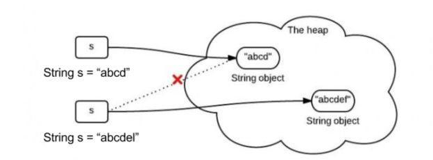

## 1 面试题：`String str1 = 'A'`与`String str2 = new String("A")`区别？

> String 定义常量和遍历的区别

`String str1 = 'A'`内存会去查找**常量池** ，如果没有的话，在永久代中中开辟一块儿内存空间，把地址付给栈指针，如果已经有了`"ABC"`的内存，直接把地址赋给栈指针；
(a) ==的判断， (b) equals()的判断：都相等，因为他们的地址都相等，因此只在常量池中有一份内存空间，地址全部相同； 

 `String str = new String("a");`是根据"a"这个String对象再次构造一个String对象;在**堆**中从新new一块儿内存，把指针赋给**栈**，将新构造出来的String**对象的引用**赋给str。 因此 只要是new String()，则，栈中的地址都是指向最新的new出来的堆中的地址，
(a)“”==“” 是判断地址的，当然不相同；
(b)至于equals,String类型重写了 equals()方法，判断值是否相等，明显相等，因此 equals 是相等的；

```java
String a = "abc";
String b = "abc";
//a==b 的结果是true
//String常量存放在常量池中，Java虚拟出于优化的考虑，会让内容一致的对象共享内存块。

String b1 = new String("abc")
//b==b1 false 常量池和堆空间 不可能一致
String b2 = new String("abc")    
//b1==b2 false 内存地址不相同
    
String c = "a";
String d = c +"bc";
String e = "a"+"bc";
//a==d false
//a=e true
```


## 2 面试题：String 的“不可变性”




> 一旦一个 String 对象在内存（堆）中被创建出来，它就无法被修改（因为 String 类的所有成员变量都是 private，并且没有提供 public 的 set 方法来修改这些值。此外成员变量都是 final 的，这就意味着一旦初始化就无法修改）。特别要注意的是，String 类的所有方法都没有改变字符串本身的值，都是返回了一个新的对象。


## 3 String使用注意事项

*   `String a = "123";`定义的是常量,`String b1 = new String("123");`定义的是变量。**尽量使用常量**
*   如果需要一个可修改的字符串，应该使用 `StringBuffer` 或者 `StringBuilder`。否则会有大量时间浪费在垃圾回收上，因为每次试图修改都有新的 String 对象被创建出来。
*   如果修改要采用`s=s.replace('1','2')`，而不能写成`s.replace('1','2')`
> 通过`System.out.prinln()`输出是会默认调用toString方法，如果自定义类，可以重写。


## 4 面试题：String, StringBuilder, StringBuffer 区别

*   String 声明的是不可变的对象，每次操作都会生成新的对象，然后将指针指向新的对象
*   StringBuilder，StringBuffer可以在原有对象上修改，**StringBuider**为非线程安全,性能好


## 5 String的 + 操作符
编译器创建了一个 StringBuilder 对象，用于构建最终的 String，并对每个字符串调用了一次 append() 方法，最后调用toString() 生成结果，并存为 s
>当你为一个类编写 toString() 方法时，如果字符串操作比较简单，那就可以信赖编译器，它会为你合理地构造最终的字符串结果。但是，如果你要在toString()方法中使用循环，且可能有性能问题，那么最好自己创建一个 StringBuilder 对象


## 6 String的空判断
* `if(str == null || str.equals(""))`：最多人使用的一个方法, 直观, 方便, 但效率很低;

* `if(str == null || str.length() != 0 )`：比较字符串长度, 效率高, 是最好的一个方法;

* `if(str == null || str.isEmpty())`：Java SE 6.0 才开始提供的方法, 效率和方法二几乎相等, 但出于兼容性考虑, 推荐使用方法二

* `if(str == null || str == “”);`：这是一种比较直观,简便的方法,而且效率也非常的高,与方法二、三的效率差不多;

  


## 7 StringBuffer方法
> StringBuffer和StringBuilder在使用上几乎一样

- StringBuffer append(String s) ：将指定的字符串追加到此字符序列
- StringBuffer reverse()： 将此字符序列用其反转形式取代
- delete(int start, int end)： 移除此序列的子字符串中的字符
- replace(int start, int end, String str)： 使用给定 String 中的字符替换此序列的子字符串中的字符
- insert(int offset, int i)： 将 int 参数的字符串表示形式插入此序列中


## 8 String方法

*   int length()： 返回此字符串的长度
*   char charAt(int index)： 返回指定索引处的字符
*   int indexOf(int ch)： 返回指定字符在此字符串中第一次出现处的索引
*   String substring(int beginIndex, int endIndex)：返回一个新字符串，它是此字符串的一个子字符串
*   boolean equals(Object anObject)： 将此字符串与指定的对象比较
*   boolean equalsIgnoreCase(String anotherString) ：将此 String 与另一个 String 比较，不考虑大小写
*   int compareTo(String anotherString)： 按字典顺序比较两个字符串
*   int compareToIgnoreCase(String str) ：按字典顺序比较两个字符串，不考虑大小写
*   String concat(String str) ：将指定字符串连接到此字符串的结尾
*   String replace(char oldChar, char newChar)： 返回一个新的字符串，newChar替换此字符串中出现的所有oldChar
*   String trim()： 返回字符串的副本，忽略前导空白和尾部空白
*   String[] split(String regex) ：根据给定正则表达式的匹配拆分此字符串
*   String toUpperCase()/String toLowerCase() ：字符串大小写转换