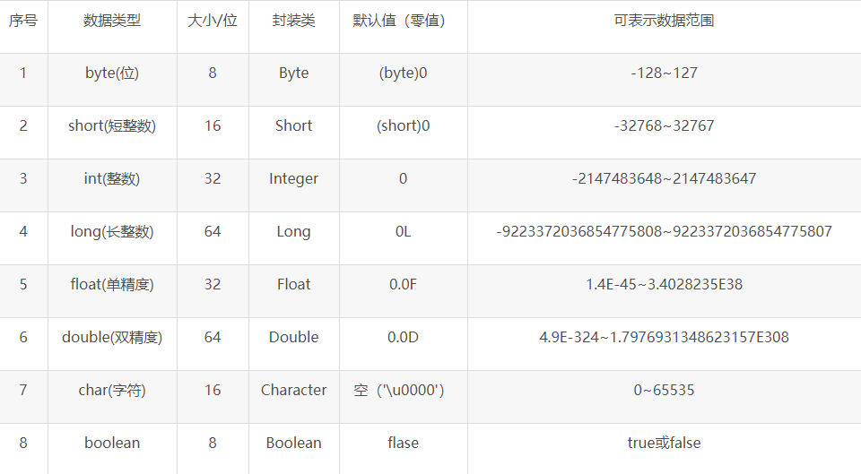
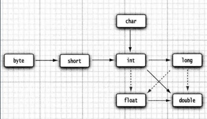

## 八大基本类型
> 1字节(b)=8比特(bit)

- **整型**
  - byte 1字节 示例：取值范围（有符号）：-2^7 ~ 2^7-1，即-128 ~ 127 
  - short 2字节
  - int 4字节
  - long 8字节
  - Java 没有任何无符号（unsigned) 形式的 int、 long、short 或 byte 类型
- **浮点型**
  - float 4字节
  - double 8字节 绝大部分应用程序都采用double 类型
- **字符型** 2字节
- **boolean型** 1字节

### 取值范围和默认值


> 对于数值类型的基本类型的取值范围，我们无需强制去记忆，因为它们的值都已经以常量的形式定义在对应的包装类中，除了Boolean类型
- 包装类的.SIZE ：二进制位数，如 Integer.SIZE 为 8
- 包装类.MIN_VALUE 最小值
- 包装类.MAX_VALUE最大值


### 类型转换

- 自动类型转换
  
  - 自动转换按从低到高的顺序转换
  
- boolean类型与其他基本类型不能进行类型的转换（既不能进行自动类型的提升，也不能强制类型转换）， 否则，将编译出错。

    
  
- 强制类型转换
  - 强制转换的格式是在需要转型的数据前加上“( )”，然后在括号内加入需要转化的数据类型。
  - 将高级变量转换成低级变量时，可能导致溢出或精度的降低。

## 包装类
Byte, Short, Integer, Long, Float, Double 继承 Number 类

### 方法
- isLetter() 是否是一个字母 
- isDigit() 是否是一个数字字符 
- isWhitespace() 是否是一个空白字符 
- isUpperCase() 是否是大写字母 
- isLowerCase() 是否是小写字母 
- toUpperCase() 指定字母的大写形式 
- toLowerCase() 指定字母的小写形式
- toString() 返回字符的字符串形式，字符串的长度仅为1

### 拆箱 装箱

- 自动装箱/拆箱

```java
Integer i = 10;  //装箱
int n = i;   //拆箱
```

- **装箱过程是通过调用包装类的`valueOf`静态方法实现的**
- **拆箱过程是通过调用包装类实例的`xxxValue`方法实现的**

###面试题：Integer 装箱缓存：

```java
        Integer a = 100;
        Integer b = 100;
        System.out.println(a == b);//true

        Integer c = 200;
        Integer d = 200;
        System.out.println(c == d);//false
```

valueOf 方法的实现（JDK8的实现）

```java
public static Integer valueOf(int i) {
    if (i >= IntegerCache.low && i <= IntegerCache.high)
        return IntegerCache.cache[i + (-IntegerCache.low)];
    return new Integer(i);
}
```

> IntegerCache静态代码块中的一段，默认Integer cache 的下限是-128，上限默认127，可以配置，所以到这里就清楚了，我们上面当赋值100给Integer时，刚好在这个range内，所以从cache中取对应的Integer并返回，所以二次返回的是同一个对象，所以==比较是相等的，当赋值200给Integer时，不在cache 的范围内，所以会new Integer并返回，当然==比较的结果是不相等的。


### 面试题：== 和equals()区别
- == 
  - 对于基本类型，比较的是值是否相同
  - 对于引用类型，比较的是内存地址
- equals()
  - 基本类型的包装类和String类型都重写了该方法，变成了值比较。


## final 和 static
- final 用于声明属性，方法和类，分别表示属性不可变，方法不可覆盖，类不可继承。
- static 修饰的成员变量和成员方法独立于该类的任何对象，类加载的时候，就进行创建和初始化，无需创建对象使用。
 - static final 一起修饰成员变量和成员方法时，可简单理解为“全局常量”。对于变量，表示一旦给值就不可修改，并且通过类名可以访问，该变量被类的所有实例共享。对于方法，表示不可覆盖，并且可以通过类名直接访问


## 大数计算

java.math 包中的两个很有用的类，可以处理包含任意长度数字序列的数值,也是 Number 的子类

- Biglnteger 实现了任意精度的整数运算
- BigDecimal 实现了任意精度的浮点数运算


## 基本类型和String类转换

### 基本类型转换成String类型

  - **包装类 的 toString() 方法**

  - `String.valueOf()` 静态方法

    ```java
    int a=123;
    String s=String.valueOf(a); //s="123"
    ```

  - 空字符串`""`+一个基本类型变量

### String转换成基本类型

  - **包装类的 valueOf() 静态方法**

  - 包装类的 parseXxx 静态方法

    ```java
    String a="123";
    int b=Integer.parseInt(str); //b=123
    ```