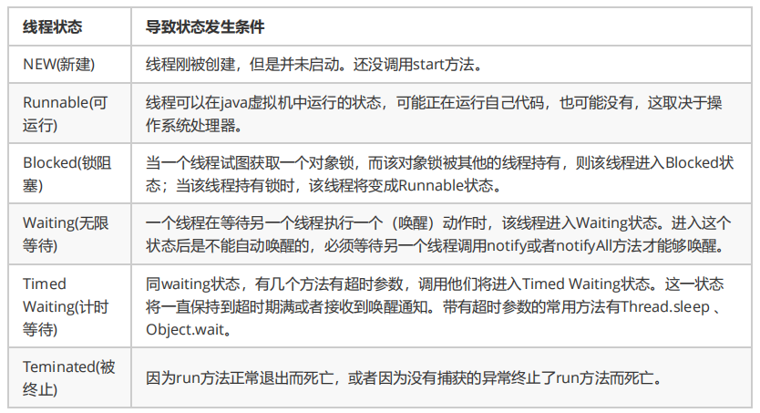

## 上下文切换

CPU通过时间片分配算法来循环执行任务，当前任务执行一个时间片后会切换到下一个任务。但是，在切换前会保存上一个任务的状态，以便下次切换回这个任务时，可以再加载这个任务的状态。

**任务从保存到再加载的过程就是一次上下切换。**

- 使用Linux命令:`vmstat`可以查看上下文切换的次数，CS(Content Switch)表示上下文切换

为什么并发执行次数较少时的速度会比串行慢呢？这就是因为**线程有创建和上下文切换的开销**。

#### 如何减少上下文切换

- **无锁并发编程**。多线程竞争时，会引起上下文切换，所以多线程处理数据时，可以用一些办法来避免使用锁，如将数据的**ID**按照Hash取模分段，不同的线程处理不同段的数据
- **使用最少线程**。避免创建不需要的线程，比如任务很少，但是创建了很多线程来处理，这样会造成大量线程都处于等待状态
- **CAS 算法**。Java的Atomic包使用CAS算法来更新数据，而不需要加锁
- **协程**。在单线程里实现多任务的调度，并在单线程里维持多个任务间的切换

> [啃碎并发（三）：Java线程上下文切换](https://juejin.im/post/5b10e53b6fb9a01e5b10e9be)

---

## 死锁


线程 A 持有资源 2，线程 B 持有资源 1，他们同时都想申请对方的资源，所以这两个线程就会互相等待而进入死锁状态。

代码例子：

```java
public class DeadLockDemo {
    private static Object resource1 = new Object();//资源 1
    private static Object resource2 = new Object();//资源 2

    public static void main(String[] args) {
        new Thread(() -> {
            synchronized (resource1) {
                System.out.println(Thread.currentThread() + "get resource1");
                try {
                    Thread.sleep(1000);
                } catch (InterruptedException e) {
                    e.printStackTrace();
                }
                System.out.println(Thread.currentThread() + "waiting get resource2");
                synchronized (resource2) {
                    System.out.println(Thread.currentThread() + "get resource2");
                }
            }
        }, "线程 1").start();

        new Thread(() -> {
            synchronized (resource2) {
                System.out.println(Thread.currentThread() + "get resource2");
                try {
                    Thread.sleep(1000);
                } catch (InterruptedException e) {
                    e.printStackTrace();
                }
                System.out.println(Thread.currentThread() + "waiting get resource1");
                synchronized (resource1) {
                    System.out.println(Thread.currentThread() + "get resource1");
                }
            }
        }, "线程 2").start();
    }
}
```

输出：

```java
Thread[线程 1,5,main]get resource1
Thread[线程 2,5,main]get resource2
Thread[线程 1,5,main]waiting get resource2
Thread[线程 2,5,main]waiting get resource1
```

线程 A 通过 synchronized (resource1) 获得 resource1 的监视器锁，然后通过`Thread.sleep(1000);`让线程 A 休眠 1s 为的是让线程 B 得到执行然后获取到 resource2 的监视器锁。线程 A 和线程 B 休眠结束了都开始企图请求获取对方的资源，然后这两个线程就会陷入互相等待的状态，这也就产生了死锁。

#### **产生死锁必须具备以下四个条件：**

- 互斥，共享资源 X 和 Y 只能被一个线程占用；
- 占有且等待，线程 T1 已经取得共享资源 X，在等待共享资源 Y 的时候，不释放共享资源 X；
- 不可抢占，其他线程不能强行抢占线程 T1 占有的资源；
- 循环等待，线程 T1 等待线程 T2 占有的资源，线程 T2 等待线程 T1 占有的资源，就是循环等待。

#### **如何避免死锁**：**破坏其中一个**

- 互斥这个条件我们没有办法破坏，因为我们用锁为的就是互斥。

- 对于“占用且等待”这个条件，我们可以一次性申请所有的资源，这样就不存在等待了。

- 对于“不可抢占”这个条件，占用部分资源的线程进一步申请其他资源时，如果申请不到，可以主动释放它占有的资源，这样不可抢占这个条件就破坏掉了。

  >**超时放弃：**
  >
  >当使用synchronized关键词提供的内置锁时，只要线程没有获得锁，那么就会永远等待下去，然而Lock接口提供了`boolean tryLock(long time, TimeUnit unit) throws InterruptedException`方法，该方法可以按照固定时长等待锁，因此线程可以在获取锁超时以后，主动释放之前已经获得的所有的锁。通过这种方式，也可以很有效地避免死锁。

- 对于“循环等待”这个条件，可以靠按序申请资源来预防。所谓按序申请，是指资源是有线性顺序的。

#### 死锁检测工具

##### Jstack 命令

jstack是java虚拟机自带的一种堆栈跟踪工具。jstack用于打印出给定的java进程ID或core file或远程调试服务的Java堆栈信息。 Jstack工具可以用于生成java虚拟机当前时刻的线程快照。**线程快照**是当前java虚拟机内每一条线程**正在执行**的**方法堆栈**的集合，生成线程快照的主要目的是定位线程出现长时间停顿的原因，如`线程间死锁`、`死循环`、`请求外部资源导致的长时间等待`等。 线程出现停顿的时候通过jstack来查看各个线程的调用堆栈，就可以知道没有响应的线程到底在后台做什么事情，或者等待什么资源。

首先，我们通过`jps`确定当前执行任务的进程号:

```java
jonny@~$ jps
17216 DeadLockDemo
...
```

可以确定任务进程号是1362，然后执行`jstack`命令查看当前进程堆栈信息：

```java
jonny@~$ jstack -F 1362
Attaching to process ID 1362, please wait...
Debugger attached successfully.
Server compiler detected.
JVM version is 25.191-b12
Deadlock Detection:


Found one Java-level deadlock:
=============================

"线程 1":
  waiting to lock Monitor@0x000000001ac13578 (Object@0x0000000780c996b8, a java/lang/Object),
  which is held by "线程 2"
"线程 2":
  waiting to lock Monitor@0x000000001ac10d98 (Object@0x0000000780c996a8, a java/lang/Object),
  which is held by "线程 1"

Found a total of 1 deadlock.

```

可以看到，进程的确存在死锁，两个线程分别在等待对方持有的Object对象

##### JConsole工具

Jconsole是JDK自带的监控工具，在JDK/bin目录下可以找到。它用于连接正在运行的本地或者远程的JVM，对运行在Java应用程序的资源消耗和性能进行监控，并画出大量的图表，提供强大的可视化界面。而且本身占用的服务器内存很小，甚至可以说几乎不消耗。


> https://juejin.im/post/5aaf6ee76fb9a028d3753534

---

## 线程的声明周期和状态


#### **Java 语言中线程共有6种状态**

- NEW（初始化状态） 线程被构建，但是还没有调用start()方法

- RUNNABLE（可运行 / 运行状态）Java统称为“运行中”

- BLOCKED（阻塞状态）线程阻塞于锁

- WAITING（无时限等待）等待其他线程做出一些特定动作（通知或中断）

- TIMED_WAITING（有时限等待）可以在指定的时间自行返回

- TERMINATED（终止状态）

#### **从 NEW到RUNNABLE状态**

Java 刚创建出来的 Thread 对象就是 NEW 状态（创建 Thread 对象主要有两种方法。一种是 继承 Thread 对象，重写 run() 方法。 另一种是实现 Runnable 接口，重写 run() 方法，并将该实现类作为创建 Thread 对象的参数。）

从 NEW 状态转换到 RUNNABLE 状态很简单，只要调用线程对象的 start()方法就可以了。

#### **RUNNABLE与 BLOCKED的状态转换**

只有一种场景会触发这种转换，就是线程等待 synchronized 的隐式锁。synchronized 修饰的方法、代码块同一时刻只允许一个线程执行，其他线程只能等待，这种情况下，等待的线程就会从 RUNNABLE 转换到 BLOCKED 状态。而当等待的线程获得 synchronized 隐式锁时，就又会从 BLOCKED 转换到 RUNNABLE 状态。

####  **RUNNABLE 与 WAITING 的状态转换**

- 获得 synchronized 隐式锁的线程，调用无参数的 Object.wait() 方法。

- 调用无参数的 Thread.join() 方法。

  其中的 join() 是一种线程同步方法，例如有一个线程对象 thread A，当调用 A.join() 的时候，执行这条语句的线程会等待 thread A 执行完，而等待中的这个线程，其状态会从 RUNNABLE 转换到 WAITING。当线程 thread A 执行完，原来等待它的线程又会从 WAITING 状态转换到 RUNNABLE。

- 调用 LockSupport.park() 方法。

  其中的 LockSupport 对象，也许你有点陌生，其实 Java 并发包中的锁，都是基于它实现的。调用 LockSupport.park() 方法，当前线程会阻塞，线程的状态会从 RUNNABLE 转换到 WAITING。调用 LockSupport.unpark(Thread thread) 可唤醒目标线程，目标线程的状态又会从 WAITING 状态转换到 RUNNABLE。

####  **RUNNABLE 与 TIMED_WAITING 的状态转换** 

- 调用带超时参数的 Thread.sleep(long millis) 方法；
- 获得 synchronized 隐式锁的线程，调用带超时参数的 Object.wait(long timeout) 方法；
- 调用带超时参数的 Thread.join(long millis) 方法；
- 调用带超时参数的 LockSupport.parkNanos(Object blocker, long deadline) 方法；
- 调用带超时参数的 LockSupport.parkUntil(long deadline) 方法。

####  **从 RUNNABLE 到 TERMINATED 状态**

 线程执行完 run() 方法后，会自动转换到 TERMINATED 状态




## 线程的方法

> Object 方法 wait() wait(long) wait(long,int) notify() notifyAll()

> Thread 方法 start() join() join(long) join(long,int)  sleep() yield() interrupt()

#### sleep() 方法和 wait() 方法

- 两者都可以暂停线程的执行，wait 通常被用于线程间交互/通信，sleep 通常被用于暂停执行。

- `wait`是Object的方法，而`sleep`是Thread的方法。
- `sleep`方法不会释放锁，可以定义时间，时间过后会自动唤醒。`sleep(milliseconds)`可以用时间指定使它自动唤醒，如果时间不到，只能用`interrupt()`强行打断。
- `wait`方法会释放锁。 `sleep`不会释放资源，`wait`进入线程等待池等待，出让系统资源，其它线程可以占用CPU，要等待其它线程调用`notify`或`notifyAll`唤醒等待池中所有线程，才会进入就绪队列等待OS分配系统资源.

- `wait`、`notify`、`notifyAll`只能在同步控制方法或同步控制块中使用，而`sleep`可以任何地方使用。

#### notify()

唤醒因调用这个对象wait()方法而阻塞的线程，随机。

#### notifyAll()

唤醒全部

#### yield()

让线程让出CPU使用权，在大多数情况下，yield()将导致线程从运行状态转到可运行状态，但有可能没有效果。

#### join()

等待其他线程终止。在当前线程中调用另一个线程的join()方法，则当前线程转入阻塞状态，直到另一个进程运行结束，当前线程再由阻塞转为就绪状态。

> *在很多情况下，主线程生成并起动了子线程，如果子线程里要进行大量的耗时的运算，主线程往往将于子线程之前结束，但是如果主线程处理完其他的事务后，需要用到子线程的处理结果，也就是主线程需要等待子线程执行完成之后再结束，这个时候就要用到 join() 方法了。*

#### interrupt()

中断

如果线程处于被阻塞状态（例如处于sleep, wait, join 等状态），那么线程将立即退出被阻塞状态，并抛出一个InterruptedException异常。

如果线程处于正常活动状态，那么会将该线程的中断标志设置为 true，仅此而已。被设置中断标志的线程将继续正常运行，不受影响

## 线程的创建方式

#### 继承Thread类并重写run的方法

当调用 start() 方法启动一个线程时，虚拟机会将该线程放入就绪队列中等待被调度，当一个线程被调度时会执行该线程的 run() 方法。

```java
public class MyThread extends Thread {
    //重写run方法
    public void run() {
        // ...
    }
}

public static void main(String[] args) {
    //创建线程
    MyThread mt = new MyThread();
    //启动线程
    mt.start();
}
```

#### 实现Runnable接口的run方法

通过 Thread 调用 start() 方法来启动线程

```java
public class RunnableTask implements Runnable {
    public void run() {
        // ...
    }
}
public static void main(String[] args) {
    RunnableTask task = new RunnableTask();
    new Thread(task).start();
    new Thread(task).start();
}
```

#### 实现Callable接口的call方法

在main函数内首先创建一个FutrueTask对象，然后使用创建的FutrueTask对象作为任务创建一个线程并且启动它，最后通过FutureTask.get()等待任务执行完毕并返回结果。

```java
public class CallerTask implements Callable<String> {
    public String call() {
        return "hello"
    }
}
public static void main(String[] args) throws InterruptedException {
    //创建异步任务
    FutureTask<Integer> ft = new FutureTask<>(new CallerTask);
    //启动线程
    new Thread(ft).start();
    try{
    	String result = ft.get();
    	System.out.println(result);
    }catch(ExecutionException e){
        e.printStackTrace();
    }
}
```

#### 对比

使用继承方式的好处是方便传参，你可以在子类里面添加成员变量，通过 set 方法设置参数或者通过构造函数进行传递哦，而如果使用 Runnable 方式，则只能使用主线程里被声明为 final 的变量。

不好的地方是 Java 不支持多继承，如果继承了 Thread 类，那么子类不能再继承其他类，而 Runnable 则没有这个限制。

前两种方式都没办法拿到任务的返回结果，但是 Callable 方式可以。


### 匿名内部类创建线程

**继承Thread类实现多线程**

```java
        new Thread() {
            public void run() {
                for (int x = 0; x < 10; x++) {
                    System.out.println(Thread.currentThread().getName() + x);
                }
            }
        }.start();
```

 **实现runnable接口**

```java
 new Thread(new Runnable() {
            @Override
            public void run() {
                for (int x = 0; x < 10; x++) {
                    System.out.println(Thread.currentThread().getName() + x);
                }
            }
        }) {
        }.start();
```

### lambda表达式

```java
new Thread(()->{
    for (int x = 0; x < 10; x++)
        System.out.println(Thread.currentThread().getName() + x);
}).start();
```

- 函数式接口，接口只有一个方法
- 写法：拷贝小括号， 写死右箭头->, 落地大括号{}

