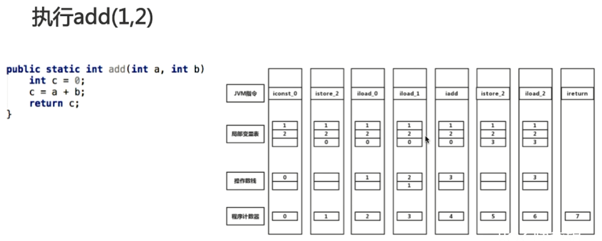
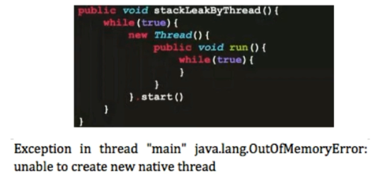
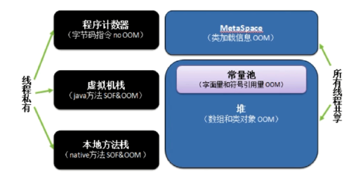
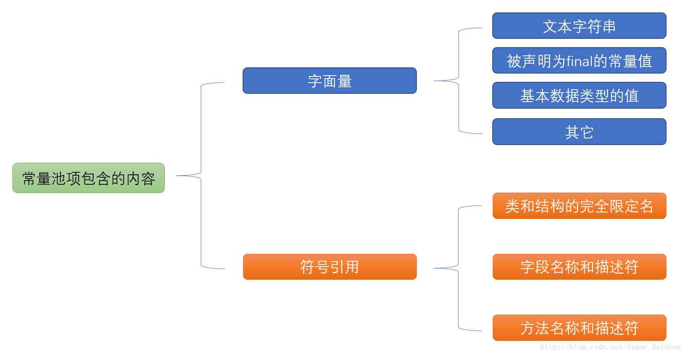
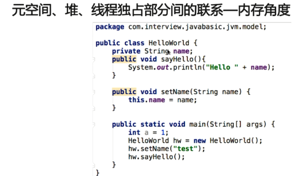
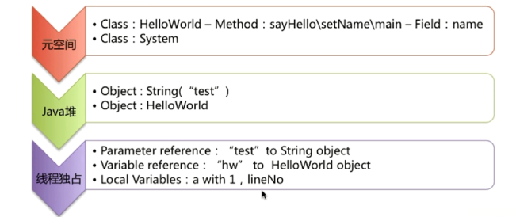
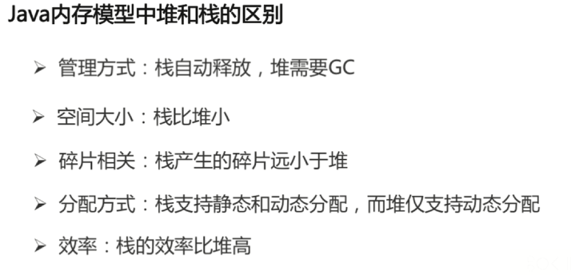
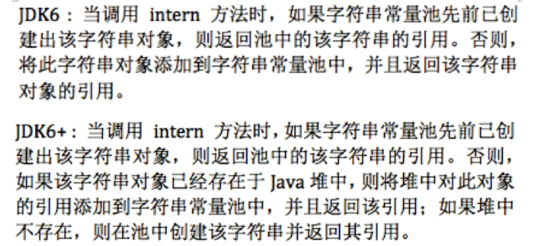
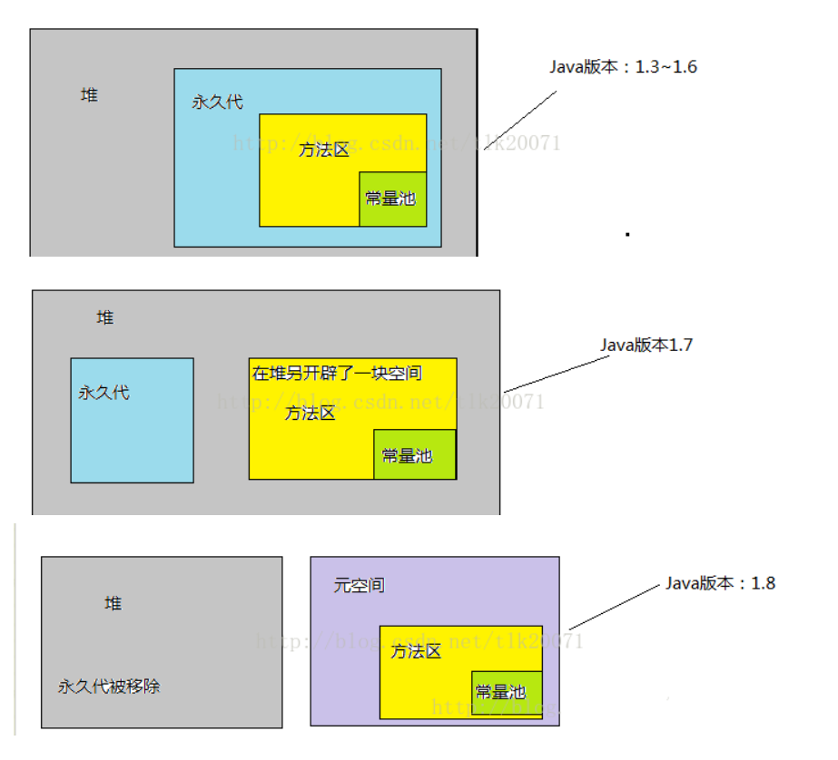

# Java内存模型

## 谈谈你对Java的理解

- 平台无关性
- GC
- 语言特性
- 面向对象
- 类型
- 异常处理

## Java内存模型

### 线程私有的

#### 程序计数器（Program Counter Register）

- 当前线程所执行的字节码行号指示器（逻辑）
- 改变计数器的值来选取下一条需要执行的字节码指令
- 和线程是一对一的关系即“线程私有”
- 对Java方法计数，如果是Native方法则计数器值为Undefined
- 不会发生内存泄漏（OutOfMemoryError）

> **程序计数器的作用**：
>
> - 字节码解释器通过改变程序计数器来依次读取指令，从而实现代码的流程控制，如：顺序执行、选择、循环、异常处理。
> - 在多线程的情况下，程序计数器用于记录当前线程执行的位置，从而当线程被切换回来的时候能够知道该线程上次运行到哪儿了。

#### 虚拟机栈（VM Stack）

- Java方法执行的内存模型

- 包含多个栈帧（Stack Frame）

- 栈帧存储了局部变量表、操作数栈、动态链接、方法出口信息等

  - 局部变量表：包含方法执行过程中的所有变量
  - 操作数栈：入栈、出栈、复制、交换、产生消费变量

  > 每一个方法从调用直至执行完成的过程，就对应着一个栈帧在虚拟机栈中入栈到出栈的过程。 

  

**Java 虚拟机栈会出现两种异常**

- **StackOverflowError：** 若 Java 虚拟机栈的内存大小不允许动态扩展，那么当线程请求栈的深度超过当前 Java 虚拟机栈的最大深度的时候，就抛出 StackOveflowError 异常。

  （递归可能会出现递归过深，栈帧数超过虚拟栈深度 ）

- **OutOfMemoryError：** 若 Java 虚拟机栈的内存大小允许动态扩展，且当线程请求栈时内存用完了，无法再动态扩展了，此时抛出 OutOfMemoryError 异常。



#### 本地方法栈（Native Method Stack）

- 与虚拟机栈类似，主要作用于标注了native的方法

>  在 HotSpot 虚拟机中和 Java 虚拟机栈合二为一。


---


### 线程共享的

#### Java堆（Heap）

- 几乎所有的对象实例以及数组都要在堆上分配
- 垃圾收集器的主要区域，也成为了“GC堆”，还可以细分为新生代和老年代
- 可以处在物理上不连续的内存空间中
- 可配置（通过-Xmx和-Xms控制），如果堆无法再扩展会抛出OutOfMemoryError异常


#### JDK 8 变化

JDK 8 取消了之前的“永久代（PermGen）”，取而代之的是“元空间”—**Metaspace**，两者本质是一样的。“永久代”使用的是 JVM 的堆内存，而“元空间”是直接使用的本机物理内存。

- 元空间使用本地内存，而永久代使用的是 JVM 的内存
- 字符串常量池存在永久代中，容易出现性能问题和内存溢出
- 类和方法的信息大小难以确定，给永久代的大小指定带来困难
- 永久代会GC带来不必要的复杂性
- 方便HotSpot与其他 JVM 如 Jrockit 的集成



#### 方法区（Method Area）

> 永久代是 HotSpot 的概念，方法区是 Java 虚拟机规范中的定义，是一种规范，而永久代是一种实现，一个是标准一个是实现，其他的虚拟机实现并没有永久带这一说法。

- 用于存储已被虚拟机加载的类信息、常量、静态变量、及时编译器编译后的代码

JDK 1.8 的时候，方法区（HotSpot 的永久代）被彻底移除了（JDK1.7 就已经开始了），取而代之是元空间，元空间使用的是直接内存。

下面是一些常用参数：

```java
-XX:MetaspaceSize=N //设置 Metaspace 的初始（和最小大小）
-XX:MaxMetaspaceSize=N //设置 Metaspace 的最大大小
```

与永久代很大的不同就是，如果不指定大小的话，随着更多类的创建，虚拟机会耗尽所有可用的系统内存。

> **为什么要将永久代 (PermGen) 替换为元空间 (MetaSpace) 呢?**
>
> 整个永久代有一个 JVM 本身设置固定大小上线，无法进行调整，而元空间使用的是直接内存，受本机可用内存的限制，并且永远不会得到 java.lang.OutOfMemoryError。你可以使用 `-XX：MaxMetaspaceSize` 标志设置最大元空间大小，默认值为 unlimited，这意味着它只受系统内存的限制。`-XX：MetaspaceSize` 调整标志定义元空间的初始大小如果未指定此标志，则 Metaspace 将根据运行时的应用程序需求动态地重新调整大小。

#### 运行时常量池（Runtime Constant Pool）

- 运行时常量池是方法区的一部分。Class 文件中除了有类的版本、字段、方法、接口等描述信息外，还有常量池信息，用于存放编译期生成的各种字面量和符号引用

- 既然运行时常量池时方法区的一部分，自然受到方法区内存的限制，当常量池无法再申请到内存时会抛出 OutOfMemoryError 异常。

- JDK1.7 及之后版本的 JVM 已经将运行时常量池从方法区中移了出来，在 Java 堆（Heap）中开辟了一块区域存放运行时常量池。



#### 直接内存

**直接内存并不是虚拟机运行时数据区的一部分，也不是虚拟机规范中定义的内存区域，但是这部分内存也被频繁地使用。而且也可能导致 OutOfMemoryError 异常出现。**

JDK1.4 中新加入的 **NIO(New Input/Output) 类**，引入了一种基于**通道（Channel）** 与**缓存区（Buffer）** 的 I/O 方式，它可以直接使用 Native 函数库直接分配堆外内存，然后通过一个存储在 Java 堆中的 DirectByteBuffer 对象作为这块内存的引用进行操作。这样就能在一些场景中显著提高性能，因为**避免了在 Java 堆和 Native 堆之间来回复制数据**。

本机直接内存的分配不会收到 Java 堆的限制，但是，既然是内存就会受到本机总内存大小以及处理器寻址空间的限制。








## 不同 JDK 版本之间的intern()方法的区别

>  intern() 方法返回字符串对象的规范化表示形式。在JVM运行时数据区中的方法区有一个常量池，但是发现在JDK1.6以后常量池被放置在了堆空间，因此常量池位置的不同影响到了String的intern()方法的表现

> 使用引号声明的字符串都是会直接在字符串常量池中生成的，而 new 出来的 String 对象是放在堆空间中的




## JVM三大性能调优参数

- -Xss：规定了每个线程虚拟机栈（堆栈）的大小
- -Xms：堆的初始值
- -Xmx：堆能达到的 最大值



---

https://blog.csdn.net/seu_calvin/article/details/52291082

https://juejin.im/post/5d4e2aa7f265da03d15540b9

