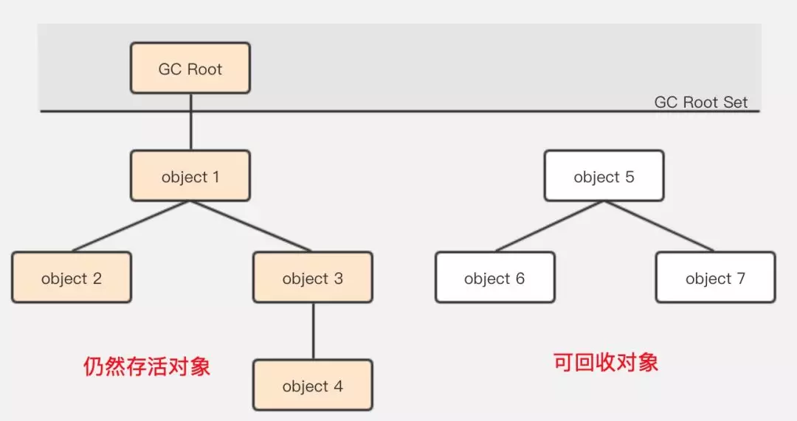
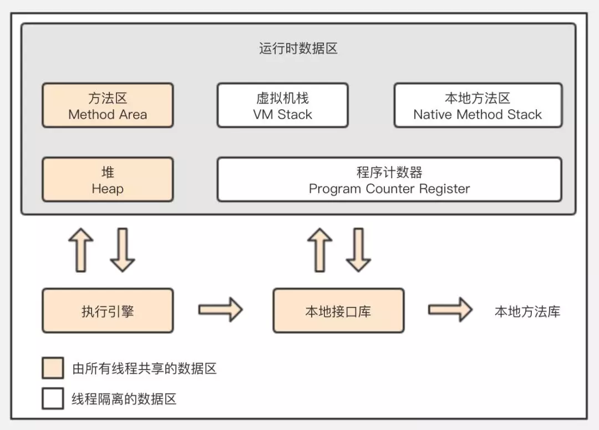
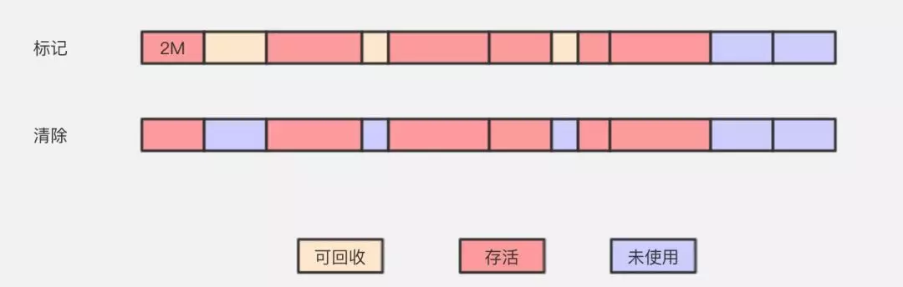
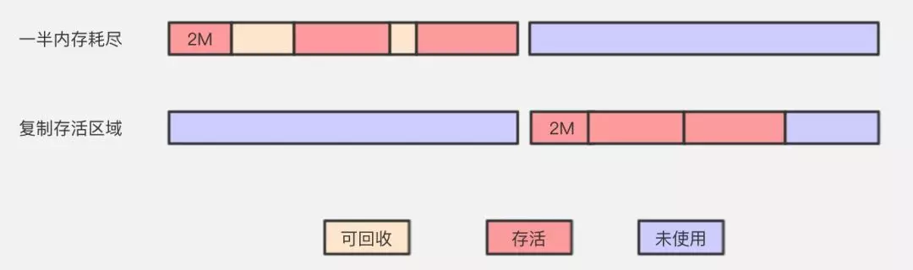
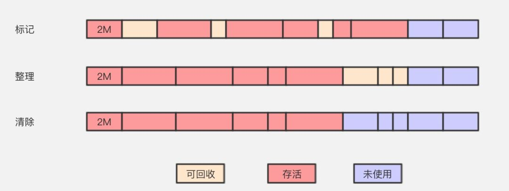
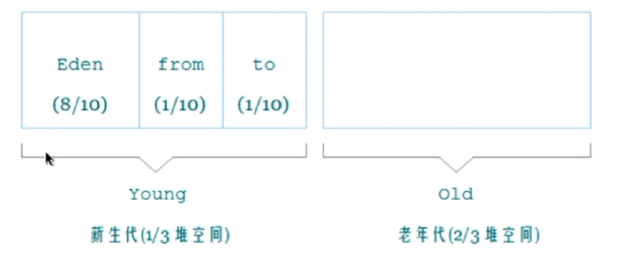
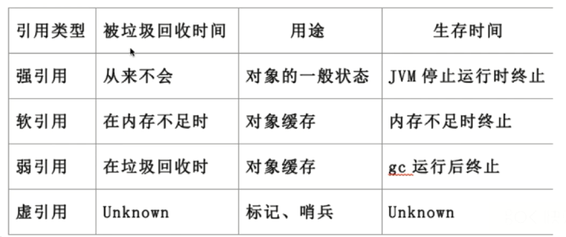
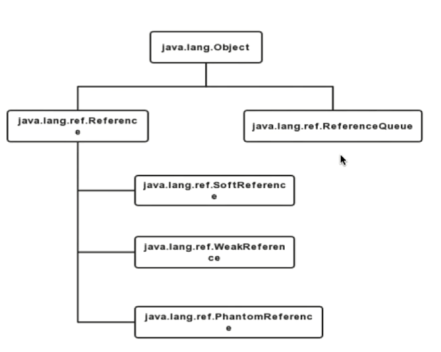

# Java垃圾回收

## 怎么定义垃圾

### 引用计数算法

- 引用计数算法（Reachability Counting）是通过在对象头中分配一个空间来保存该对象被引用的次数（Reference Count）。、
- 如果该对象被其它对象引用，则它的引用计数加1，如果删除对该对象的引用，那么它的引用计数就减1，当该对象的引用计数为0时，那么该对象就会被回收。

循环依赖问题

- 定义 2 个对象 -> 相互引用 -> 置空各自的声明引用
- 由于他们相互引用着对方，导致它们的引用计数永远都不会为 0，通过引用计数算法，也就永远无法通知 GC 收集器回收它们。

```java
public class ReferenceCountingGC {

    public Object instance;

    public ReferenceCountingGC(String name){}
}

public static void testGC(){

    ReferenceCountingGC a = new ReferenceCountingGC("objA");
    ReferenceCountingGC b = new ReferenceCountingGC("objB");

    a.instance = b;
    b.instance = a;

    a = null;
    b = null;
}
```


### **可达性分析算法**

- 可达性分析算法（Reachability Analysis）的基本思路是，通过一些被称为引用链（GC Roots）的对象作为起点，从这些节点开始向下搜索。

- 搜索走过的路径被称为 Reference Chain，当一个对象到 GC Roots 没有任何引用链相连时（即从 GC Roots 节点到该节点不可达），则证明该对象是不可用的。



#### **Java 内存区域**




**在 Java 语言中，可作为 GC Root 的对象包括以下 4 种**：

- 虚拟机栈（栈帧中的本地变量表）中引用的对象
- 方法区中类静态属性引用的对象
- 方法区中常量引用的对象
- 本地方法栈中 JNI（即一般说的 Native 方法）引用的对象


## 垃圾回收算法

### 标记-清除算法 

内存碎片问题



### 复制算法 

解决碎片问题，平分代价太高



### 标记整理算法      

内存变动频繁，效率低



### 分代收集算法

 组合拳

> 新生代中，每次垃圾收集时都发现有大批对象死去，只有少量存活，那就选用复制算法，只需要付出少量存活对象的复制成本就可以完成收集。而老年代中因为对象存活率高、没有额外空间对它进行分配担保，就必须使用标记-清理或者标记 --- 整理算法来进行回收。


## 垃圾回收过程



### 新生代

- **Eden区**

  大多数情况下，对象会在新生代 Eden 区中进行分配，当 Eden 区没有足够空间进行分配时，虚拟机会发起一次 Minor GC，Minor GC 相比 Major GC 更频繁，回收速度也更快。

  通过 Minor GC 之后，Eden 会被清空，Eden 区中绝大部分对象会被回收，而那些无需回收的存活对象，将会进到 Survivor 的 From 区（若 From 区不够，则直接进入 Old 区）。

- **Survivor区**

  - **Form区**
  - **To区**

  每次执行 Minor GC，会将 Eden 区和 From 存活的对象放到 Survivor 的 To 区（如果 To 区不够，则直接进入 Old 区）。

> Survivor 的存在意义就是减少被送到老年代的对象，进而减少 Major GC 的发生。Survivor 的预筛选保证，只有经历16次 Minor GC 还能在新生代中存活的对象，才会被送到老年代。
> 设置两个 Survivor 区最大的好处就是解决内存碎片化。因为 Survivor 有2个区域，所以每次 Minor GC，会将之前 Eden 区和 From 区中的存活对象复制到 To 区域。第二次 Minor GC 时，From 与 To 职责兑换，这时候会将 Eden 区和 To 区中的存活对象再复制到 From 区域，以此反复。

### 老年代

- 经历15次 Minor依然存活的对象
- Survivor区存放不下的对象
- 新生产的大对象（-XX:+PretenuerSizeThreshold）

> 动态对象年龄：如果 Survivor 空间中相同年龄所有对象大小的总合大于 Survivor 空间的一半，年龄大于等于该年龄的对象就可以直接进去老年区，无需等你“成年”。

老年代占据着2/3的堆内存空间，只有在 Major GC 的时候才会进行清理，每次 GC 都会触发“Stop-The-World”。内存越大，STW 的时间也越长，所以内存也不仅仅是越大就越好。由于复制算法在对象存活率较高的老年代会进行很多次的复制操作，效率很低，所以老年代这里采用的是标记 --- 整理算法。


### 常用的调优参数

- -XX:SurvivorRatio：Eden和Survivor的比例,默认8:1
- -XX:NewRatio：老年代和新生代内存大小的比例
- -XX:MaxTenuringThreshold：对象从新生代晋升到老年代经过GC的最大阈值


### GC的分类

- Minor GC 新生代GC

- Major GC 老年代GC

- Full GC 针对整个新生代、老生代、元空间（metaspace，java8以上版本取代perm gen）的全局范围的GC

- 触发条件
  - 老年代空间不足
  - 永久代空间不足（JDK7）
  - CMS GC时出现promotion failed，concurrent mode faiure
  - MinorGC晋升到老年代的平均大小的大于老年代的剩余空间
  - 调用System.gc()
  - 使用 RMI 来进行 RPC 或管理的 JDK 应用，每小时执行一次Full GC


### Stop-the-World

- JVM 由于要执行GC而停止了应用程序的执行
- 任何一种GC算法中都会发生
- 多数GC优化通过减少STW发生的时间来提高程序性能


### Safepoint

- 分析过程中对象引用关系不会发生变化的点
- 产生Safepint的地方：方法调用，循环跳转，异常跳转等
- 安全点数量得适中


## 垃圾收集器

**JVM的运行模式**

- Server
- Client

### 新生代垃圾收集器

####  Serial 收集器

- `-XX:+UseSerialGC`，复制算法

- 单线程收集，进行新垃圾收集时，必须暂停所有工作线程
- 简单高效，Client模型下默认的年轻代收集器

#### ParNew 收集器

- `-XX:UserParNewGC`，复制算法
- 多线程收集，其余的行为、特点和Serial收集器一样
- 单核执行效率不如Serial，在多核下执行才有优势

#### Parallel Scavenge 收集器

- `-XX:UseParallelGC`,复制算法
- 吞吐量=运行用户代码时间/(运行用户代码时间+垃圾收集时间)

- 比起关注用户线程停顿时间，更关注系统的吞吐量
- 在多核执行才有优势，Server模式下默认的年轻代收集器


### 老年代垃圾收集器

####  Serial Old收集器

- `-XX:+UseSerialOldGC`，标记-整理算法

- 单线程收集，进行新垃圾收集时，必须暂停所有工作线程
- 简单高效，Client模型下默认的老年代收集器

#### Parallel Old 收集器

- `-XX:UseParallelOldGC`,标记-整理算法
- 多线程，吞吐量优先

#### CMS 收集器

- `-XX:+UseConcMarkSweepGC`，标记-清除算法
  - 初始标记：stop-the-world
  - 并发标记：并发追溯标记，程序不会停顿
  - 并发预清理：查找执行并发标记阶段从年轻代晋升老年代的对象
  - 重新标记：暂停虚拟机，扫描CMS堆中的剩余对象
  - 并发清理：清理垃圾对象，程序不会停顿
  - 并发重置：重置CMS收集器的数据结构

### G1收集器

- `-XX:+UseG1GC`，复制+标记-整理算法
- 并行和并发
- 分代收集
- 空间整合
- 可预测的停顿
- 将整个Java堆内存划分为多个大小相等Region
- 年轻代和老年代不再物理隔离


## Object的finalize()方法

- 与C++的析构函数不同，它是不确定的
- 将未被引用的对象放置于F-Queue队列
- 方法执行随时可能被终止
- 给予对象一次重生的机会


## Java中的强引用、软引用、弱引用、虚引用

- **强引用**
  - 最普遍的引用`Object obj = new Object()`
  - 抛出`OutofMemoryError`终止程序也不会回收具有强引用的对象
  - 通过将对象设置为null来弱化引用，使其被回收
- **软引用**
  - 对象处在有用但非必须的状态
  - 只有当内存空间不足时，GC 会回收该引用的对象的内存
  - 可以用来实现高速缓存

```java
String str= new String("abc");//强引用
SoftReference<String> softRef = new SoftReference<String>(Str);//软引用
```

- **弱引用**
  - 非必须的对象，比软引用更弱一些
  - GC时会被回收
  - 被回收的概率也不大，因为GC线程优先级比较低
  - 适用于引用偶尔被使用且不影响垃圾收集的对象

```java
String str= new String("abc");//强引用
WeekReference<String> weekRef = new WeekReference<String>(Str);//弱引用
```

- **虚引用**
  - 不会决定对象的声明周期
  - 任何时候都可能被垃圾回收器回收
  - 跟踪对象呗垃圾收集器会回收的活动，起哨兵的作用
  - 必须和引用队列ReferenceQueue联合使用

```java
String str= new String("abc");//强引用
ReferenceQueue queue = new ReferenceQueue();
PhantomReference<String> phantomRef = new PhantomReference<String>(Str);//虚引用
```





### 引用队列（ReferenceQueue）

- 无实际存储结构，存储逻辑依赖于内部节点之间的关系来表达
- 存储关联的且被GC的软引用，弱引用，虚引用


---

https://mp.weixin.qq.com/s/IEdGkx-CJec8Diw62uOIng

https://my.oschina.net/hosee/blog/644618


