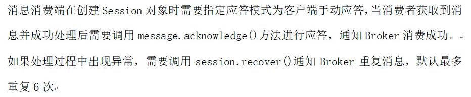
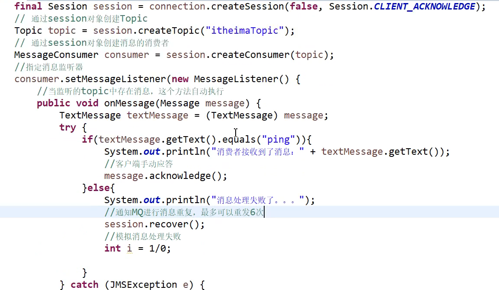

参考https://zhuanlan.zhihu.com/p/52773169

## MQ应用场景

消息队列中间件是分布式系统中的重要组件，主要解决应用解耦，异步消息，流量削峰等问题，实现高性能，高可用，可伸缩和最终一致性架构。目前使用较多的消息队列有 ActiveMQ，RabbitMQ，Kafka，RocketMQ等

### 1.异步处理

### 2.应用解耦

### 3.流量削峰

## JMS消息模型( Java Message Service )

### 1. 点对点模型（P2P）

**包含3个角色：消息队列（Queue）、发送者（Sender）、接收者（Receiver）**

每个消息都被发送到一个特定的队列，接受者从队列中获取消息。队列保留着消息，知道被消费或超时。

**特点：**

- 每个消息只有一个消费者，消息一旦被消费，机会从队列中消失。

- 发送者和接收之间没有依赖关系，接收者未接收不会影响发送者。

- 接收者接收到消息的时候，需要向队列进行反馈。

> 如果希望每个消息都会被成功处理，使用P2P模型

### 2. 发布/订阅模型（Pub/Sub）

**包含3个角色：主题（Topic）、发布者（Publisher）、订阅者（Subscriber）**

多个发布者将消息发送到Topic，系统将这些 消息传递给多个订阅者。

**特点：**

- 每个消息都可以有多个消费者。

- 发布者和订阅者有时间上的依赖，订阅者必须在创建一个订阅之后，才能消费发布者的消息。

- 为了缓和时间上的依赖，JMS允许订阅者创建一个持久化的订阅

- 为了消费信息，订阅者必须一直处于运行的状态。

如果希望发送的消息可以被多个消费者处理的话，那么可以采用Pub/Sub模式。

### JMS消息确认机制

## 失败重发代码

先执行test2()，在执行test()。

## 持久化

### 持久化到文件（默认）

生成者

消费者

### 持久化到数据库（mysql）

配置文件

## zookeeper+active集群实现高可用

安装

