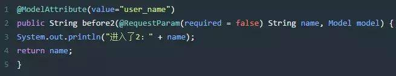
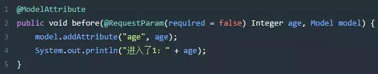
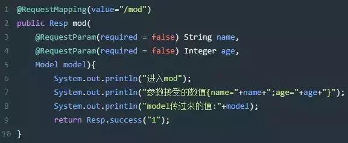
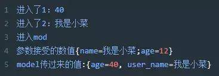
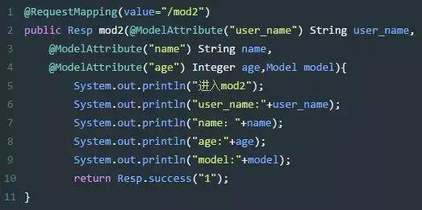
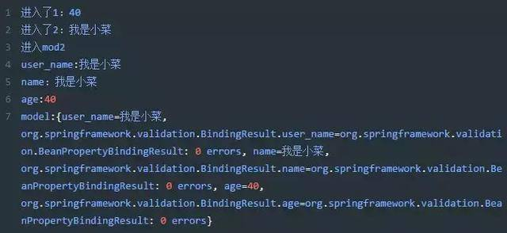

## 常用注解

- @Controller 不解释

- @RequestMapping

  - value 地址
  - method  GET、POST、PUT、DELETE
  - consumes，produces
  - params： 指定request中必须包含某些参数值是，才让该方法处理。
  - headers： 指定request中必须包含某些指定的header值，才能让该方法处理请求。

- @ResponseBody

- @RestController：@Controller 和 @ResponseBody的注解组合。

  ---

- @**RequestParam** **可以省略**
放在参数前，表示只能接收参数a=b格式的数据，即Content-Type为`application/x-www-form-urlencoded`类型的内容。
这种参数形如：name=xxx&age=xxx。可能是拼接在url上的，如get方法，也可能是放在http requestBody 里面的。这种参数可以使用RequestParam注解接受，如果请求参数和方法参数一致的话，可以省略RequestParam注解。

- @**RequestBody**
  放在参数前，表示参数从request body中获取，而不是从地址栏获取，所以这肯定是接收一个POST请求的非a=b格式的数据，即Content-Type不为application/x-www-form-urlencoded类型的内容。

  > @RequestBody接收的是一个Json对象的字符串，而不是一个Json对象。在进行对象封装后，需要使用JSON.stringify(data)的把对象变成字符串，然后才能调用ajax提交。

```json
//使用@RequestBody注解的时候，前台的Content-Type必须要改为application/json,json指的是字符串
"status": 415,
"error": "Unsupported Media Type",
```
- @**PathVariable**
  拥有绑定url中的占位符的。例如：url中有/delete/{id}，{id}就是占位符

  ---

- @RequestHeader
  放在方法参数前，用来获取request header中的参数值
  
- @CookieValue
  放在方法参数前，用来获取request header cookie中的参数值

- @SessionAttribute
  用于多次执行控制器方法间的参数共享

  ---

### @ModelAttribute

该注解是 SpringMVC4.3 版本以后新加入的。它可以用于修饰方法和参数
出现在方法上，表示当前方法会在控制器的方法执行之前，先执行。
出现在参数上，获取指定的数据给参数赋值。

> 应用场景：当表单提交数据不是完整的实体类数据时，保证没有提交数据的字段使用数据库对象原来的数据

#### 使用地方有三种：

##### 1 标记在方法上

  标记在方法上，会在每一个 @RequestMapping 标注的方法前执行，如果有返回值，则自动将该返回值加入到 ModelMap 中。

- 在有返回的方法上:
    当ModelAttribute设置了value，方法返回的值会以这个value为key，以参数接受到的值作为value，存入到Model中，如下面的方法执行之后，最终相当于 model.addAttribute("user_name", name);假如 @ModelAttribute没有自定义value，则相当于
    model.addAttribute("name", name);

    

- 在没返回的方法上：
    需要手动model.add方法

    

  我们在当前类下建一个请求方法：

  

  在浏览器中输入访问地址并且加上参数：
  `http://localhost:8081/api/test/mod?name=我是小菜&age=12`
  最终输出如下：

  

##### 2 标记在方法的参数上。

标记在方法的参数上，会将客户端传递过来的参数按名称注入到指定对象中，并且会将这个对象自动加入ModelMap中，便于View层使用.我们在上面的类中加入一个方法如下

  

 在浏览器中输入访问地址并且加上参数：
  `http://localhost:8081/api/test/mod2?name=我是小菜&age=12`
  最终输出：

  

从结果就能看出，用在方法参数中的@ModelAttribute注解，实际上是一种接受参数并且自动放入Model对象中，便于使用。