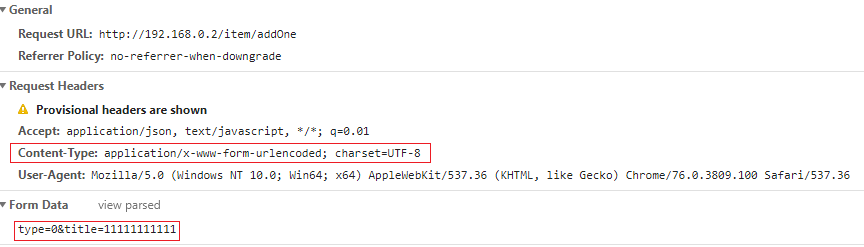
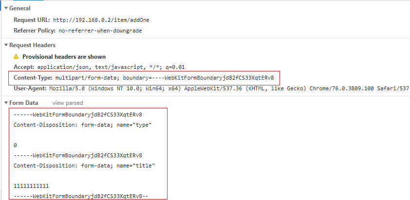
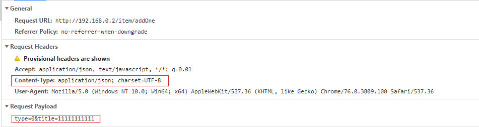
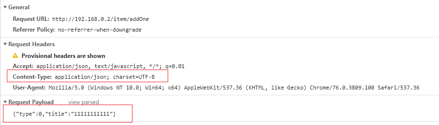

## POST发送数据格式

### 1.application/x-www-form-urlencoded

> 如果不设置Content-Type，默认以`application/x-www-form-urlencoded`提交数据

### 2.multipart/form-data

> 适用文件上传
>

### 3. application/json

> 适用数据结构较复杂，层级较深的情况。

> 如果想以 JSON 格式把数据提交到后台的话，`JSON.stringify()` 必须有，否则只会当做表单提交

- JSON对象:`var str2 = { "name": "deluyi", "sex": "man" };`
- JSON字符串:`var str1 = '{ "name": "deyuyi", "sex": "man" }';`

**如果不序列化：**

**序列化：**

### x-www-form-urlencoded和json格式对比

**前者对比后者**

- 前端传递数据不用转换为json字符串：JSON.stringify(user) 
- 后端接受的参数很灵活，即可以封装为User对象，亦可以使用单个参数username,rememberMe，甚至User对象和单个rememberMe参数混合使用都可以

